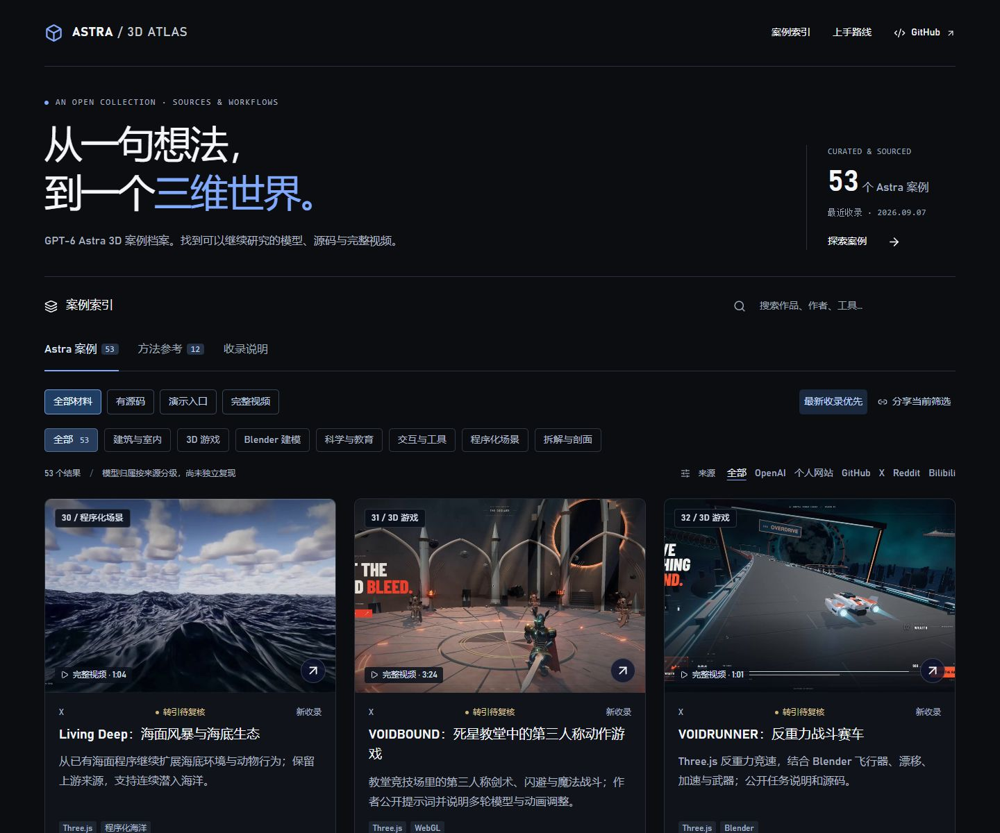
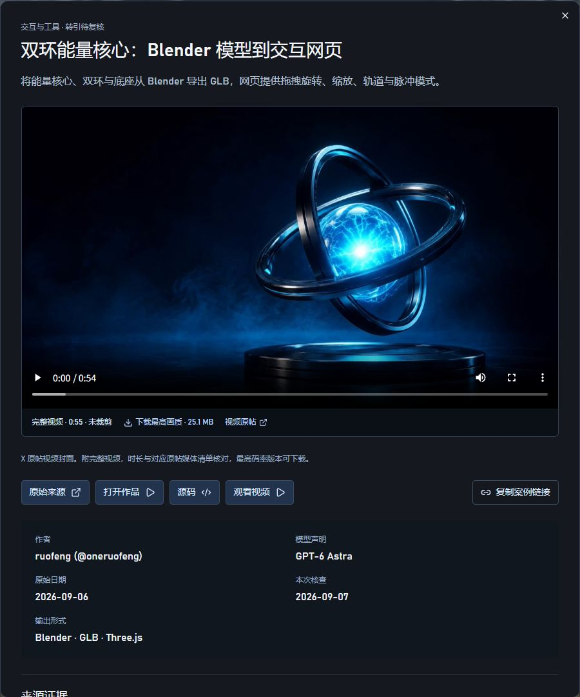
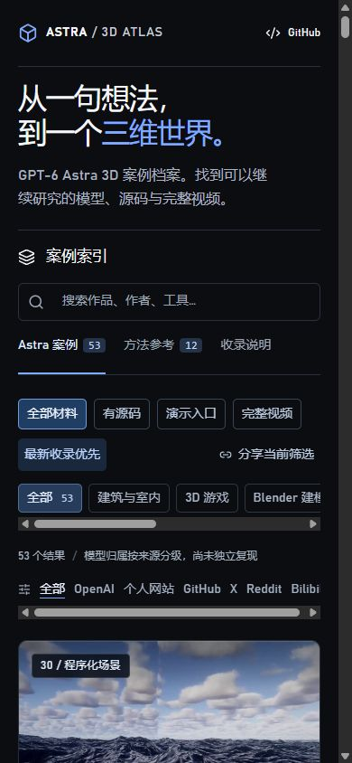

# Awesome Astra 3D

[简体中文](README.md) · **English**

**Find a 3D result, then follow it to the original creator, prompt, editable project or source code.** A curated collection of GPT-6 Astra examples across Blender, Three.js, WebGL, architecture, games and spatial tools.

**[Explore the gallery](https://carpentry-liu.github.io/awesome-astra-3d/) · [Start here](START_HERE.md) · [Latest additions](UPDATES.md) · [Contribute](CONTRIBUTING.md)**

<!-- atlas:summary:start -->
Updated **2026-09-07 (Asia/Shanghai)** · **53 Astra examples** · **15 with source / project links** · **22 complete videos** · **12 separately labeled references**.
<!-- atlas:summary:end -->

[](https://carpentry-liu.github.io/awesome-astra-3d/?order=newest#top)

Captured on 2026-09-07 with newest additions first. Click the screenshot to browse the same view.

## Eight works to explore

The first six are newly added; the final two are established starting points with useful process material. Images and the gameplay GIF come from the original creators.

<table>
  <tr>
    <td width="50%" valign="top">
      <a href="https://carpentry-liu.github.io/awesome-astra-3d/#case=ruofeng-orbital-core"></a>
      <h3>Orbital Core · Model to website</h3>
      <p>Blender project, GLB and Three.js interactions, with a complete video.</p>
      <p>ruofeng (@oneruofeng) · Secondary evidence<br><a href="https://carpentry-liu.github.io/awesome-astra-3d/#case=ruofeng-orbital-core">View case</a> · <a href="https://github.com/wangruofeng/orbital-core-showcase">Source / project</a> · <a href="https://carpentry-liu.github.io/awesome-astra-3d/#case=ruofeng-orbital-core">Full video · 0:55</a> · <a href="https://x.com/oneruofeng/status/2096551010089263181">Original source</a></p>
    </td>
    <td width="50%" valign="top">
      <a href="https://carpentry-liu.github.io/awesome-astra-3d/#case=mollick-living-ocean"></a>
      <h3>Living Deep · Ocean world</h3>
      <p>An ocean world expanded from an existing sea simulation, with source and a complete video.</p>
      <p>Ethan Mollick · Secondary evidence<br><a href="https://carpentry-liu.github.io/awesome-astra-3d/#case=mollick-living-ocean">View case</a> · <a href="https://github.com/emollick/abyssal-living-deep">Source / project</a> · <a href="https://carpentry-liu.github.io/awesome-astra-3d/#case=mollick-living-ocean">Full video · 1:04</a> · <a href="https://x.com/emollick/status/2095673885605630429">Original source</a></p>
    </td>
  </tr>
  <tr>
    <td width="50%" valign="top">
      <a href="https://carpentry-liu.github.io/awesome-astra-3d/#case=amsminn-smash-karts"></a>
      <h3>Smash Karts · Multiplayer arena</h3>
      <p>The author’s gameplay GIF; Three.js game, server and agent trajectory are public.</p>
      <p>amsminn · Author report<br><a href="https://carpentry-liu.github.io/awesome-astra-3d/#case=amsminn-smash-karts">View case</a> · <a href="https://github.com/amsminn/gpt-6-astra-smash-karts">Source / project</a> · <a href="https://github.com/amsminn/gpt-6-astra-smash-karts">Original source</a></p>
    </td>
    <td width="50%" valign="top">
      <a href="https://carpentry-liu.github.io/awesome-astra-3d/#case=goroman-facet-fighter"></a>
      <h3>FACET FIGHTER · PS1 fighting game</h3>
      <p>The author’s emulator screenshot; PSn00bSDK source and prompt history are public.</p>
      <p>GOROman · Author report<br><a href="https://carpentry-liu.github.io/awesome-astra-3d/#case=goroman-facet-fighter">View case</a> · <a href="https://github.com/GOROman/gpt-6-astra-ps1-game-benchmark">Source / project</a> · <a href="https://github.com/GOROman/gpt-6-astra-ps1-game-benchmark">Original source</a></p>
    </td>
  </tr>
  <tr>
    <td width="50%" valign="top">
      <a href="https://carpentry-liu.github.io/awesome-astra-3d/#case=openai-giverny-garden"></a>
      <h3>Giverny · Water garden</h3>
      <p>A Blender render from the official article: water lilies, a green bridge and a planted garden.</p>
      <p>Thomas Ricouard · Official showcase<br><a href="https://carpentry-liu.github.io/awesome-astra-3d/#case=openai-giverny-garden">View case</a> · <a href="https://developers.openai.com/blog/architectural-visualization-with-astra">Original source</a></p>
    </td>
    <td width="50%" valign="top">
      <a href="https://carpentry-liu.github.io/awesome-astra-3d/#case=openai-helios-collector"></a>
      <h3>HELIOS · Stellar collector</h3>
      <p>A Blender concept-scene render from the official article, with the author’s process.</p>
      <p>Thomas Ricouard · Official showcase<br><a href="https://carpentry-liu.github.io/awesome-astra-3d/#case=openai-helios-collector">View case</a> · <a href="https://developers.openai.com/blog/architectural-visualization-with-astra">Original source</a></p>
    </td>
  </tr>
  <tr>
    <td width="50%" valign="top">
      <a href="https://carpentry-liu.github.io/awesome-astra-3d/#case=simonw-pelican-bicycle"></a>
      <h3>Pelican bicycle · Editable Blender scene</h3>
      <p>Three iterations of .blend files, Python scripts and Codex conversation history.</p>
      <p>Simon Willison · Author report<br><a href="https://carpentry-liu.github.io/awesome-astra-3d/#case=simonw-pelican-bicycle">View case</a> · <a href="https://github.com/simonw/gpt-6-astra-blender-pelican-bicycle">Source / project</a> · <a href="https://til.simonwillison.net/llms/blender-coding-agents-macos">Original source</a></p>
    </td>
    <td width="50%" valign="top">
      <a href="https://carpentry-liu.github.io/awesome-astra-3d/#case=openai-solace-garden-house"></a>
      <h3>Solace · Architecture and interiors</h3>
      <p>A courtyard-house render from the official article; a Blender → Cycles → UE5 workflow.</p>
      <p>Thomas Ricouard · Official showcase<br><a href="https://carpentry-liu.github.io/awesome-astra-3d/#case=openai-solace-garden-house">View case</a> · <a href="https://developers.openai.com/blog/architectural-visualization-with-astra">Original source</a></p>
    </td>
  </tr>
</table>

The collection identifies source quality and available materials; inclusion does not mean we independently reproduced the project.

## Choose a starting point

| Your next experiment | What is available | Start with |
| --- | --- | --- |
| Study an editable Blender scene | `.blend`, Python scripts and the author's conversation | [Simon Willison's pelican bicycle](https://github.com/simonw/gpt-6-astra-blender-pelican-bicycle) |
| Bring a model into a website | Blender source, GLB and Three.js interactions | [Orbital Core Showcase](https://github.com/wangruofeng/orbital-core-showcase) |
| Explore browser game code | A single HTML game and the original task | [Mosswing](https://github.com/Ayi1337/gpt6-astra-one-shot-games/tree/main/mosswing) |
| Inspect multiplayer implementation | Three.js game, server and public agent trajectory | [Smash Karts Arena](https://github.com/amsminn/gpt-6-astra-smash-karts) |
| Follow a longer design process | Blender and Unreal walkthroughs, with author commentary | [Solace](https://developers.openai.com/blog/architectural-visualization-with-astra) |

**[Examples with source code](https://carpentry-liu.github.io/awesome-astra-3d/?resource=source#collection) · [Author-provided demo links](https://carpentry-liu.github.io/awesome-astra-3d/?resource=demo#collection) · [Complete archived videos](https://carpentry-liu.github.io/awesome-astra-3d/?resource=video#collection)**

The gallery interface is in Chinese; English case names, creator names and tool names are searchable. Demo availability and access requirements vary by author. We have reviewed sources, not independently reproduced every project.

## What each entry tells you

- Whether the output is a render, geometry, an editable project or an interactive experience.
- Whether a prompt is public, partial, described by the author or unavailable.
- Where to find the original post, project, demo and available media.
- Whether the model attribution comes from an official showcase, the author or a secondary source.

Image-generation references are kept in a separate group and excluded from the Astra count. Comparisons and unsuccessful attempts retain their limitations. Missing information remains missing.

## Complete videos

[](https://carpentry-liu.github.io/awesome-astra-3d/#case=ruofeng-orbital-core)

<details>
<summary>Mobile gallery screenshot</summary>

[](https://carpentry-liu.github.io/awesome-astra-3d/?order=newest#top)

</details>


X media is archived as complete source-provided MP4 renditions: the highest-bitrate file and a smaller playback version. Files are not clipped or transcoded. The gallery plays the smaller rendition and links to the higher-quality download. Source IDs, durations, byte counts and SHA-256 hashes are recorded in the [media manifest](data/videos.json); large files live in [GitHub Releases](https://github.com/carpentry-liu/awesome-astra-3d/releases).

## Use the index

The public [JSON index](https://carpentry-liu.github.io/awesome-astra-3d/cases.json) needs no API key:

```js
const cases = await fetch(
  'https://carpentry-liu.github.io/awesome-astra-3d/cases.json'
).then(response => response.json());
const withCode = cases.filter(
  item => item.group === 'astra' && item.repositoryUrl
);
```

To run this gallery locally, use Node.js 22.13+ (22.22.0 recommended):

```sh
npm ci
npm run dev
npm run check
npm run build
```

This runs the collection website, not the third-party games or models. See the original repositories for their requirements.

## Contribute and follow updates

Found an original project, a missing source, or an incorrect attribution? [Submit a case or correction](https://github.com/carpentry-liu/awesome-astra-3d/issues/new?template=case.yml). Include the original creator and a clear model statement. The [contribution guide](CONTRIBUTING.md) explains the data fields.

If this index helps you find a useful project, a Star makes it easier to find again. New additions are listed in [UPDATES.md](UPDATES.md).

## Attribution

Organization was inspired by [awesome-gpt-image-2](https://github.com/freestylefly/awesome-gpt-image-2) and [GPT-Image2-Skill](https://github.com/wuyoscar/GPT-Image2-Skill). [Tripo's Astra collection](https://github.com/TripoGrowthLab/awesome-astra-prompts) provided additional discovery leads; entries were checked against author sources where available, and rewritten briefs are not presented as original prompts.

Independent collection, not an official OpenAI project. Original repository code is MIT licensed. Third-party works, media, prompts and assets retain their own rights; the repository license does not grant permission to redistribute them. See [rights and removal information](README.md#权利).
