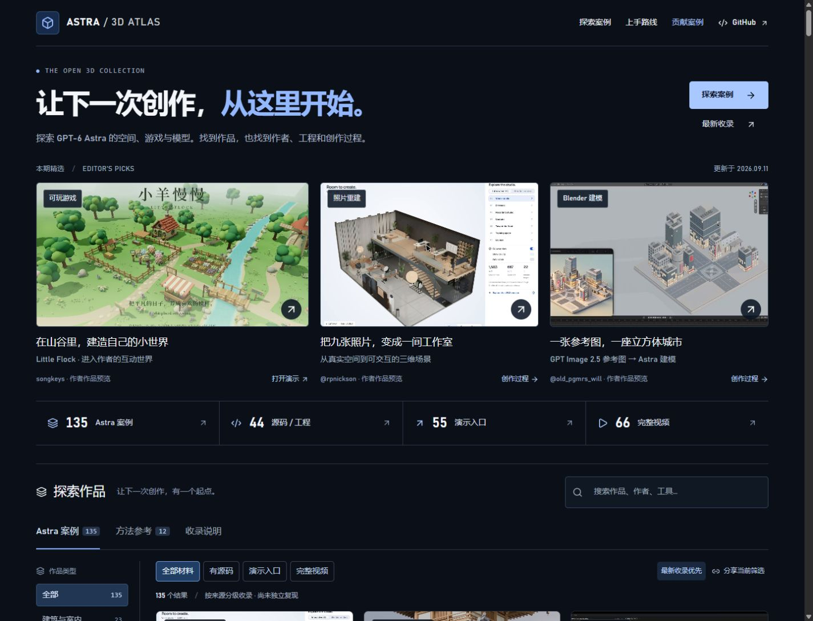
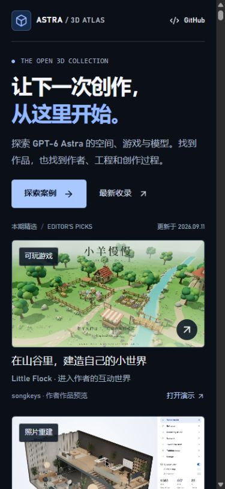

<div align="center">

# Awesome GPT-6 Astra 3D

### Real work. Original creators. Your next starting point.

Explore GPT-6 Astra in 3D: Blender, Three.js, WebGL, CAD, VRM and interactive games. Find attributed examples, editable projects, demos and complete videos.

**[Explore the live gallery](https://carpentry-liu.github.io/awesome-astra-3d/) · [Latest additions](https://carpentry-liu.github.io/awesome-astra-3d/?order=newest#collection) · [Contribute](CONTRIBUTING.md)**

[简体中文](README.md) · English

</div>

<!-- atlas:summary:start -->
Updated **2026-09-11 (Asia/Shanghai)** · **135 Astra examples** · **44 source / project links** · **55 demo links** · **66 complete videos** · **12 separate references**.
<!-- atlas:summary:end -->

## New work, at a glance

| Nine photos → a studio | Houdini · procedural architecture | Car soccer · brick weather |
| --- | --- | --- |
| [](https://carpentry-liu.github.io/awesome-astra-3d/#case=nickson-studio-photos) | [](https://carpentry-liu.github.io/awesome-astra-3d/#case=yokohara-houdini) | [](https://carpentry-liu.github.io/awesome-astra-3d/#case=jannn-brick-weather) |
| Reference → cube city | Tallinn · scene assets | Little Flock · a farming world |
| [](https://carpentry-liu.github.io/awesome-astra-3d/#case=will-cube-city) | [](https://carpentry-liu.github.io/awesome-astra-3d/#case=yachimat-tallinn) | [](https://carpentry-liu.github.io/awesome-astra-3d/#case=songkeys-little-flock) |

Open a preview for the complete recording, workflow and original source. Images remain on creator hosts; Little Flock is credited to Songkeys (CC BY 4.0). Brick soccer includes 3DAIStudio assets. The Tallinn preview shows scene assets; 3D previs and H3 output are labeled separately in its case file.

## Choose a starting point

| Your goal | Open |
| --- | --- |
| Try a project | [Creator demos](https://carpentry-liu.github.io/awesome-astra-3d/?resource=demo#collection) |
| Continue building | [Source code and editable projects](https://carpentry-liu.github.io/awesome-astra-3d/?resource=source#collection) |
| Watch the work in motion | [Complete source videos](https://carpentry-liu.github.io/awesome-astra-3d/?resource=video#collection) |
| Follow a learning path | [Blender, web and game starting points](START_HERE.md) |
| Reuse the index | [Catalog](CATALOG.md) · [Public JSON](https://carpentry-liu.github.io/awesome-astra-3d/cases.json) |

## Latest additions

This update adds **6 examples and 8 complete X videos**, each with its highest-bitrate original and a smaller full-length playback version. New subjects include photo reconstruction, Houdini, brick weather, shoe-last motion, cube cities and Tallinn scenes. Mixed-tool stages retain their attribution; an unverified playable link is not counted as a demo.

<!-- atlas:latest:start -->
| Example | Creator | Resources |
| --- | --- | --- |
| [Studio from Nine Photos](https://carpentry-liu.github.io/awesome-astra-3d/#case=nickson-studio-photos) | Roberto Nickson / @rpnickson | [Original](https://x.com/rpnickson/status/2097488440489116111) |
| [Procedural Modeling in Houdini](https://carpentry-liu.github.io/awesome-astra-3d/#case=yokohara-houdini) | Hirokazu Yokohara / @Yokohara_h | [Original](https://x.com/Yokohara_h/status/2097666997719089337) |
| [Brick Weather Car Soccer](https://carpentry-liu.github.io/awesome-astra-3d/#case=jannn-brick-weather) | Jan / @CreatedByJannn | [Original](https://x.com/CreatedByJannn/status/2097706846056558912) |
| [Shoe Last Motion Workflow](https://carpentry-liu.github.io/awesome-astra-3d/#case=flora-shoe-last) | FLORA © / @floraai | [Original](https://x.com/floraai/status/2097763728217272598) |
| [Cube City from an Image Reference](https://carpentry-liu.github.io/awesome-astra-3d/#case=will-cube-city) | いにしえ@高信頼AIニュース"NeuralWire.org"運営｜Will Oldgram / @old_pgmrs_will | [Original](https://x.com/old_pgmrs_will/status/2097506064078147861) |
| [Tallinn Scene and Previsualization](https://carpentry-liu.github.io/awesome-astra-3d/#case=yachimat-tallinn) | yachimat - AI Short Anime / @yachimat_manga | [Original](https://x.com/yachimat_manga/status/2097810202762285265) |
| [Little Flock](https://carpentry-liu.github.io/awesome-astra-3d/#case=songkeys-little-flock) | songkeys | [Demo](https://sharpherd.song.work) · [Source](https://github.com/songkeys/little-flock) · [Original](https://github.com/songkeys/little-flock) |
| [Japanese Flower Shop Exploded View](https://carpentry-liu.github.io/awesome-astra-3d/#case=kana-flower-shop) | KANA｜東京AI映像 / @KanaWorks_AI | [Original](https://x.com/KanaWorks_AI/status/2097153139795468365) |
<!-- atlas:latest:end -->

[Full update history →](UPDATES.md)

## The gallery

Three featured works are visible together. Desktop navigation places categories and sources beside the image-led gallery; mobile filters scroll horizontally. Resource totals link directly to matching cases, and cards expose source and demo links. Combine keyword, category, platform and resource filters, then share the resulting URL. Each case has a direct detail link, attribution, model evidence and available process material.

The interface is in Chinese; English project names, tools and creators are searchable. Keyboard navigation, a mobile layout and image failure states are supported.

<details>
<summary>Desktop and mobile screenshots · September 11, 2026</summary>

[](https://carpentry-liu.github.io/awesome-astra-3d/)



</details>

## Projects to study

| Project | What to inspect | Materials |
| --- | --- | --- |
| Solace | Architectural iteration through Blender, Cycles and UE5 | [Creator walkthrough](https://developers.openai.com/blog/architectural-visualization-with-astra) |
| Pelican on a bicycle | Three iterations, editable meshes and recorded conversations | [Source project](https://github.com/simonw/gpt-6-astra-blender-pelican-bicycle) |
| Orbital Core | Blender and GLB assets in an interactive Three.js page | [Source](https://github.com/wangruofeng/orbital-core-showcase) · [Demo](https://orbital-core-showcase.wangruofeng007.workers.dev/) |
| Living Deep | Extending an existing ocean simulation with underwater ecology | [Source](https://github.com/emollick/abyssal-living-deep) · [Demo](https://abyssal-living-deep.netlify.app/) |
| Smash Karts | Multiplayer client, server and agent trajectory | [Source](https://github.com/amsminn/gpt-6-astra-smash-karts) |

## Evidence, not assumptions

| Label | Meaning |
| --- | --- |
| Official showcase | An official project page explicitly identifies Astra |
| Author statement | An accessible creator post, article or repository identifies the model |
| Secondary evidence | The original page is restricted; a mirror, quote or collection provides the statement |
| Method reference | Separately grouped composition and prompting references, excluded from Astra counts |

Renders, geometry, editable projects and interactive pages are distinguished. Failed attempts and comparisons retain their limitations. Unknown dates and unpublished prompts remain missing. GPT Image 2 references are never relabeled as Astra geometry.

**Inclusion, attribution and an HTTP response do not establish independent reproduction.** External demos can require desktop hardware, WebGPU, additional assets or sign-in. See the [demo audit](data/demo-audit.json) and [research notes](data/research.json).

## Run locally

Use Node.js 22.13+ (22.22.0 recommended). No API key is needed for this static collection.

```sh
git clone https://github.com/carpentry-liu/awesome-astra-3d.git
cd awesome-astra-3d
npm ci
npm run dev
```

```sh
npm run check
npm run lint
npm run build
```

The build synchronizes catalogs, bilingual statistics, latest additions, public JSON and the sitemap, then exports to `dist/client/`. On Windows with Node 24+, it uses the official npm-distributed Node 22.22.0 runtime for prerender compatibility. Use `npm run catalog` after editing `data/cases.json`.

**Public demo: [GitHub Pages](https://carpentry-liu.github.io/awesome-astra-3d/).** The [Pages workflow](.github/workflows/pages.yml) checks, builds, verifies existing video assets and publishes pushes to `main`. The existing Sites configuration is retained for the owner's alternate preview with its current access settings.

## Repository map

- `data/`: cases, video manifests, research and link checks.
- `app/`: welcome page, gallery, details and responsive styling.
- `src/`: filtering, video playback and the read-only WebMCP search tool.
- `scripts/` and `tests/`: generated documentation, export validation and behavior tests.
- [docs/](docs/README.md): requirements, design and verification records.

## Contribute and attribution

[Submit a case or correction](https://github.com/carpentry-liu/awesome-astra-3d/issues/new?template=case.yml) with the original creator, explicit model statement and verifiable links. See [CONTRIBUTING.md](CONTRIBUTING.md).

Organization was inspired by [awesome-gpt-image-2](https://github.com/freestylefly/awesome-gpt-image-2) and [GPT-Image2-Skill](https://github.com/wuyoscar/GPT-Image2-Skill). [Tripo's Astra collection](https://github.com/TripoGrowthLab/awesome-astra-prompts) supplied some discovery leads; model attribution is checked against original sources where possible.

Original repository code is [MIT licensed](LICENSE). Third-party works, images, prompts, videos and assets retain their own rights. This license grants no additional redistribution rights. Images remain on creator hosts.

Previously archived X videos use complete source-provided renditions without clipping or transcoding. Full duration means the entire posted clip, not the whole development process. The [media manifest](data/videos.json) records duration, byte count and SHA-256; files live in [GitHub Releases](https://github.com/carpentry-liu/awesome-astra-3d/releases). Their inclusion does not assert additional creator permission. See [rights and removal information](README.md#权利).

Independent collection, not an official OpenAI project.
