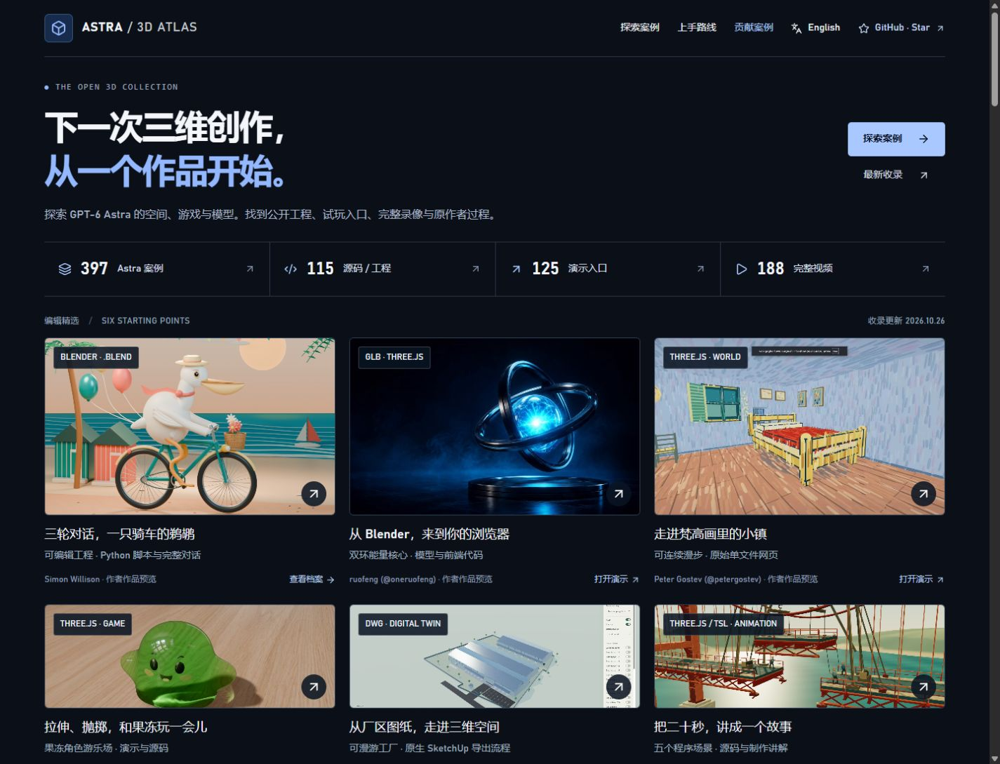
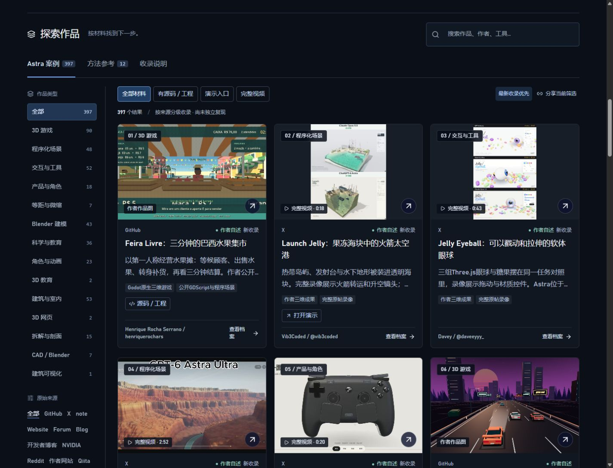
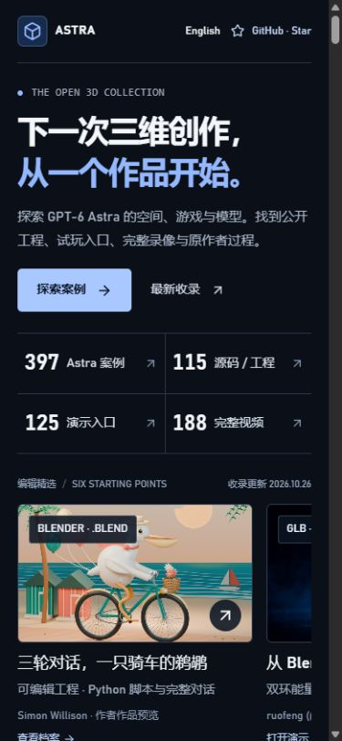
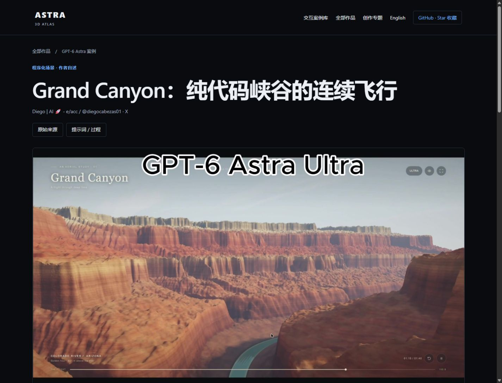

<div align="center">

# Awesome GPT-6 Astra 3D

### Your next 3D starting point: public projects, creator demos and complete clips.

Explore Blender models, Three.js games, architectural worlds and exploded assemblies. See the result, inspect the creator's materials, then start with one small change.

**[Explore the gallery](https://carpentry-liu.github.io/awesome-astra-3d/?lang=en) · [Three starting paths](START_HERE.en.md) · [Latest additions](https://carpentry-liu.github.io/awesome-astra-3d/?lang=en&order=newest#collection) · [Contribute](CONTRIBUTING.md)**

[简体中文](README.md) · English · [English website](https://carpentry-liu.github.io/awesome-astra-3d/?lang=en)

</div>

<!-- atlas:summary:start -->
Updated **2026-10-26 (Asia/Shanghai)** · **397 Astra examples** · **115 source / project links** · **125 demo links** · **188 complete videos** · **12 separate references**.
<!-- atlas:summary:end -->

Source / project totals count public material links; demo totals count creator-hosted entry points. They do not establish independent reproduction of every project. Complete videos retain the full posted clip. Each case records attribution and model evidence.

## Six featured works to start from

| Pelican on a bicycle · Simon Willison | Orbital Core · ruofeng | Van Gogh's Town · Peter Gostev |
| --- | --- | --- |
| [](https://carpentry-liu.github.io/awesome-astra-3d/en/cases/simonw-pelican-bicycle/) | [](https://carpentry-liu.github.io/awesome-astra-3d/en/cases/ruofeng-orbital-core/) | [](https://carpentry-liu.github.io/awesome-astra-3d/en/cases/peter-van-gogh-town/) |
| Three `.blend` iterations, scripts and conversations to compare geometry and composition. | Blender → GLB → Three.js, with assets and interaction code. | A continuous painted world, with original HTML, task sources and a complete clip. |
| Jelly Baby · Scott | Jetis · bambssquad / Bam | Five 3D stories · az9713 |
| [](https://carpentry-liu.github.io/awesome-astra-3d/en/cases/scottstts-jelly-baby/) | [](https://carpentry-liu.github.io/awesome-astra-3d/en/cases/bambssquad-jetis-digital-twin/) | [](https://carpentry-liu.github.io/awesome-astra-3d/en/cases/az9713-refined-animations/) |
| Stretch and throw a Three.js character; inspect the creator's demo and code. | DWG-based factory walkthrough and SketchUp export, with explicit dimension assumptions. | Five twenty-second procedural scenes, Three.js / TSL code and development notes. |

Open an image for the case, materials and known limitations. This selection stays stable; new additions are listed separately below. Preview images remain on creator hosts.

## Choose materials and make one small change

| Your goal | Start here |
| --- | --- |
| Open a `.blend`, change a material or camera | [Blender path](START_HERE.en.md#blender) · [Blender topic](https://carpentry-liu.github.io/awesome-astra-3d/en/topics/blender/) |
| Connect a GLB to a page and adjust an interaction | [Web path](START_HERE.en.md#web) · [Source / project collection](https://carpentry-liu.github.io/awesome-astra-3d/?lang=en&resource=source#collection) |
| Read a game task, then trace it through the code | [Game path](START_HERE.en.md#game) · [Browser games](https://carpentry-liu.github.io/awesome-astra-3d/en/topics/browser-games/) |
| Study spaces, assemblies and motion | [Architecture](https://carpentry-liu.github.io/awesome-astra-3d/en/topics/architecture/) · [Exploded assemblies](https://carpentry-liu.github.io/awesome-astra-3d/en/topics/exploded/) · [Complete clips](https://carpentry-liu.github.io/awesome-astra-3d/?lang=en&resource=video#collection) |
| Try, search or cite | [Creator demos](https://carpentry-liu.github.io/awesome-astra-3d/?lang=en&resource=demo#collection) · [Catalog](CATALOG.md) · [Public JSON](https://carpentry-liu.github.io/awesome-astra-3d/cases.json) |

[Star to save this evolving index of 3D projects and examples](https://github.com/carpentry-liu/awesome-astra-3d). Found your own work or a missing resource? [Submit a case or correction](https://github.com/carpentry-liu/awesome-astra-3d/issues/new?template=case.yml).

## Website preview

[](https://carpentry-liu.github.io/awesome-astra-3d/?lang=en)

Website screenshots were refreshed on **October 26, 2026** from the current local production build. See the creator previews and latest additions below for this update. Browse in Chinese or English, open task topics and share individual case pages. The gallery starts with 36 cards and can load the remaining matches.

<details>
<summary>Gallery, mobile and case screenshots · October 26, 2026</summary>

[](https://carpentry-liu.github.io/awesome-astra-3d/?lang=en&order=newest#collection)



[](https://carpentry-liu.github.io/awesome-astra-3d/en/cases/diego-grand-canyon-astra/)

</details>

## Latest additions

Ordered by collection date, separate from each work's original publication and verification dates. Featured works stay independent of daily additions.

The October 26 update adds **5 works and 4 complete X clips**: Feira Livre, Launch Jelly, a gummy eyeball, a Grand Canyon flight, and an interactive gamepad. Materials include one public Godot project, one Astra demo, and two full-task links. About 252 seconds retain complete original and smaller platform renditions. Canyon geometry is attributed to Astra and music to Suno; the gamepad archive is the second, Astra-labelled clip. Two dark posters use source-linked actual frames with timestamps. X posts date from October 24–25; the market project publication date remains unknown. Today is their collection date.

<!-- atlas:update-previews:start -->
**This update in pictures — creator works**

| Feira Livre · public Godot project | Launch Jelly · Astra below |
| --- | --- |
| [](https://carpentry-liu.github.io/awesome-astra-3d/en/cases/henrique-feira-livre-simulator/) | [](https://carpentry-liu.github.io/awesome-astra-3d/en/cases/vib3coded-launch-jelly-comparison/) |
| Gummy eye · Astra above | Canyon · Astra scene / Suno music |
| [](https://carpentry-liu.github.io/awesome-astra-3d/en/cases/davey-gummy-eyeball-comparison/) | [](https://carpentry-liu.github.io/awesome-astra-3d/en/cases/diego-grand-canyon-astra/) |
| Gamepad · second source clip, Astra | Watch the complete clips |
| [](https://carpentry-liu.github.io/awesome-astra-3d/en/cases/leo-interactive-gamepad-astra/) | [Watch the 4 new clips](https://carpentry-liu.github.io/awesome-astra-3d/?lang=en&resource=video&order=newest#collection) · [Original files](https://github.com/carpentry-liu/awesome-astra-3d/releases/tag/media-2026-10-26) |
<!-- atlas:update-previews:end -->

<!-- atlas:latest:start -->
| Example | Creator | Resources |
| --- | --- | --- |
| [Feira Livre — A Three-minute Brazilian Street Market](https://carpentry-liu.github.io/awesome-astra-3d/en/cases/henrique-feira-livre-simulator/) | Henrique Rocha Serrano / henriquerochars | [Source](https://github.com/henriquerochars/feira-livre-simulator) · [Original](https://github.com/henriquerochars/feira-livre-simulator) |
| [Launch Jelly — A Spaceport Inside a Jelly Cube](https://carpentry-liu.github.io/awesome-astra-3d/en/cases/vib3coded-launch-jelly-comparison/) | Vib3Coded / @vib3coded | [Demo](https://launch-jelly-vibecoded1.vercel.app/) · [Original](https://x.com/vib3coded/status/2114132632166347208) |
| [Jelly Eyeball — Three Models Build a Soft-body Eye](https://carpentry-liu.github.io/awesome-astra-3d/en/cases/davey-gummy-eyeball-comparison/) | Davey / @daveeyyy_ | [Original](https://x.com/daveeyyy_/status/2114014158102397168) |
| [Grand Canyon — A Continuous Procedural Canyon Flight](https://carpentry-liu.github.io/awesome-astra-3d/en/cases/diego-grand-canyon-astra/) | Diego \| AI 🚀 - e/acc / @diegocabezas01 | [Original](https://x.com/diegocabezas01/status/2114033292999630853) |
| [Designed to Be Held — An Interactive 3D Gamepad](https://carpentry-liu.github.io/awesome-astra-3d/en/cases/leo-interactive-gamepad-astra/) | Leo · Building w/ AI / @leo114119 | [Original](https://x.com/leo114119/status/2113878845426110685) |
| [Neon Overdrive — Four Districts of Arcade Highway Racing](https://carpentry-liu.github.io/awesome-astra-3d/en/cases/vanshd-neon-overdrive/) | vanshd132 | [Source](https://github.com/vanshd132/Neon-Overdrive) · [Original](https://github.com/vanshd132/Neon-Overdrive) |
| [Midnight Orbit — A 3D Pinball Comparison](https://carpentry-liu.github.io/awesome-astra-3d/en/cases/leppppp1-pinball-comparison/) | 渣渣的赛博宇宙 / @leppppp1 | [Original](https://x.com/leppppp1/status/2113846772770779388) |
| [Tabletop Railway — Two Animated Miniature Worlds](https://carpentry-liu.github.io/awesome-astra-3d/en/cases/aman-tabletop-railway-comparison/) | Aman / @Amank1412 | [Original](https://x.com/Amank1412/status/2113699831248220177) |
<!-- atlas:latest:end -->

[Full update history →](UPDATES.md) · [Maintenance and verification](docs/maintenance.md)

## Evidence, not assumptions

| Label | Meaning |
| --- | --- |
| Official showcase | An official project page explicitly identifies Astra |
| Author statement | An accessible creator post, article or repository identifies the model |
| Secondary evidence | The original page is restricted; a mirror, quote or collection provides the statement |
| Method reference | Separately grouped composition and prompting references, excluded from Astra counts |

Renders, geometry, editable projects and interactive pages are distinguished. Failed attempts and comparisons retain their limitations. Unknown dates and unpublished prompts remain missing. GPT Image 2 references are never relabeled as Astra geometry.

**Inclusion, attribution and an HTTP response do not establish independent reproduction.** External demos can require desktop hardware, WebGPU, additional assets or sign-in. See the [demo audit](data/demo-audit.json), [catalog link audit](data/link-audit.json) and [research notes](data/research.json).

## Run locally

Use Node.js 22.22.0+; the version pinned in `.node-version` is recommended. No API key is needed for this static collection.

```sh
git clone https://github.com/carpentry-liu/awesome-astra-3d.git
cd awesome-astra-3d
npm ci
npm run dev     # Develop the React homepage
```

```sh
npm run check
npm run lint
npm run build
npm start       # Preview dist/client after building, on port 4173 by default
```

The build generates independent `/cases/`, topic and browse pages; check them through `npm start` after building. It synchronizes catalogs, bilingual statistics, latest additions, public JSON and the sitemap, then exports to `dist/client/`. On Windows with Node 24+, it uses the official npm-distributed Node 22.22.0 runtime for prerender compatibility. Use `npm run catalog` after editing `data/cases.json`.

**Public demo: [GitHub Pages](https://carpentry-liu.github.io/awesome-astra-3d/).** The [Pages workflow](.github/workflows/pages.yml) checks, builds, verifies existing video assets and publishes pushes to `main`. See the [maintenance guide](docs/maintenance.md) for content and media checks.

## Repository map

- `data/`: cases, video manifests, research and link checks.
- `app/`: welcome page, gallery, details and responsive styling.
- `src/`: filtering, video playback and the read-only WebMCP search tool.
- `scripts/` and `tests/`: generated documentation, export validation and behavior tests.
- [docs/](docs/README.md): current maintenance, requirements, screenshots and review records.

## Contribute and attribution

[Submit a case or correction](https://github.com/carpentry-liu/awesome-astra-3d/issues/new?template=case.yml) with the original creator, explicit model statement and verifiable links. See [CONTRIBUTING.md](CONTRIBUTING.md).

Organization was inspired by [awesome-gpt-image-2](https://github.com/freestylefly/awesome-gpt-image-2) and [GPT-Image2-Skill](https://github.com/wuyoscar/GPT-Image2-Skill). [Tripo's Astra collection](https://github.com/TripoGrowthLab/awesome-astra-prompts) supplied some discovery leads; model attribution is checked against original sources where possible.

Original repository code is [MIT licensed](LICENSE). Third-party works, images, prompts, videos and assets retain their own rights. This license grants no additional redistribution rights. Images remain on creator hosts.

Previously archived X videos use complete source-provided renditions without clipping or transcoding. Full duration means the entire posted clip, not the whole development process. The [media manifest](data/videos.json) records duration, byte count and SHA-256; files live in [GitHub Releases](https://github.com/carpentry-liu/awesome-astra-3d/releases). Their inclusion does not assert additional creator permission. See [rights and removal information](README.md#权利).

Independent collection, not an official OpenAI project.
