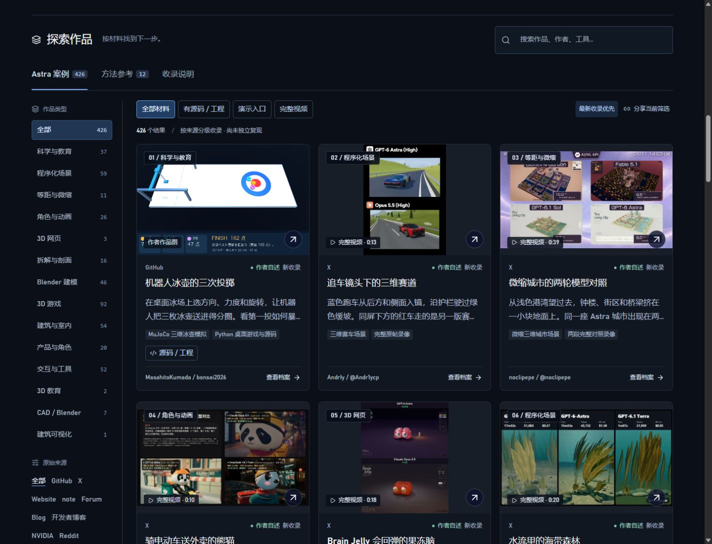
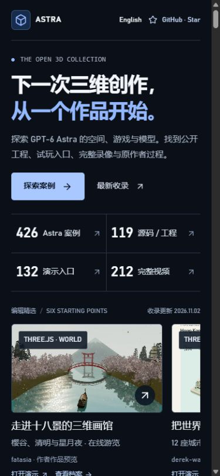
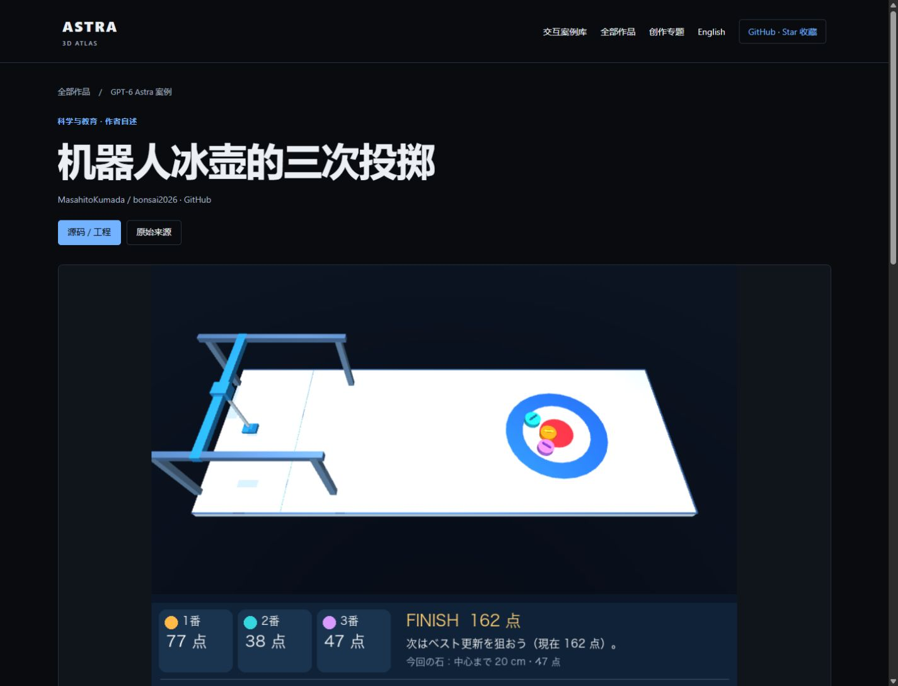

<div align="center">

# Awesome GPT-6 Astra 3D

### Your next 3D starting point: public projects, creator demos and complete clips.

Explore Blender models, Three.js games, architectural worlds and exploded assemblies. See the result, inspect the creator's materials, then start with one small change.

**[Explore the gallery](https://carpentry-liu.github.io/awesome-astra-3d/?lang=en) · [Three starting paths](START_HERE.en.md) · [Latest additions](https://carpentry-liu.github.io/awesome-astra-3d/?lang=en&order=newest#collection) · [Contribute](CONTRIBUTING.md)**

[简体中文](README.md) · English · [English website](https://carpentry-liu.github.io/awesome-astra-3d/?lang=en)

</div>

<!-- atlas:summary:start -->
Updated **2026-11-02 (Asia/Shanghai)** · **426 Astra examples** · **119 source / project links** · **132 demo links** · **212 complete videos** · **12 separate references**.
<!-- atlas:summary:end -->

Source / project totals count public material links; demo totals count creator-hosted entry points. They do not establish independent reproduction of every project. Complete videos retain the full posted clip. Each case records attribution and model evidence.

## Six featured works to start from

| [WITHIN · fatasia](https://fatasia.github.io/within/) | [CityMaker · derek-wangpch](https://citymaker.0to1app.com/) | [Shenzhen After Rain · Skyline](https://kostikoneuro.github.io/kimi-vs-astra/2a-diorama/astra/) |
| --- | --- | --- |
| [](https://fatasia.github.io/within/) | [](https://citymaker.0to1app.com/) | [](https://kostikoneuro.github.io/kimi-vs-astra/2a-diorama/astra/) |
| Explore eighteen worlds, from Sakura to painted cities.<br>[Try the demo](https://fatasia.github.io/within/) · [Case](https://carpentry-liu.github.io/awesome-astra-3d/en/cases/fatasia-within-gallery/) · [Source](https://github.com/fatasia/within) | Merge landmarks into a 3D game of 2048.<br>[Try the demo](https://citymaker.0to1app.com/) · [Case](https://carpentry-liu.github.io/awesome-astra-3d/en/cases/derek-opencitymaker/) · [Source](https://github.com/derek-wangpch/OpenCityMaker) | The image is a Blender render; the demo is a Three.js scene of the same market.<br>[Try the demo](https://kostikoneuro.github.io/kimi-vs-astra/2a-diorama/astra/) · [Case](https://carpentry-liu.github.io/awesome-astra-3d/en/cases/kosti-shenzhen-night-market/) · [Source](https://github.com/KostiKoNeuro/kimi-vs-astra) |
| [Embryo Explorer · Pratik Gandhi](https://embryoexplorer.com/) | [Jetis · bambssquad / Bam](https://bambssquad.github.io/jetis-digital-twin-astra/) | [Five 3D stories · az9713](https://az9713.github.io/gpt-6-astra-builds/latest/) |
| [](https://embryoexplorer.com/) | [](https://bambssquad.github.io/jetis-digital-twin-astra/) | [](https://az9713.github.io/gpt-6-astra-builds/latest/) |
| Zoom into and explore a simplified educational model.<br>[Try the demo](https://embryoexplorer.com/) · [Case](https://carpentry-liu.github.io/awesome-astra-3d/en/cases/pratikgx-embryo-explorer/) · [Source](https://github.com/pratikgx/embryo-explorer) | A DWG-based factory walkthrough and SketchUp export, with dimension assumptions.<br>[Try the demo](https://bambssquad.github.io/jetis-digital-twin-astra/) · [Case](https://carpentry-liu.github.io/awesome-astra-3d/en/cases/bambssquad-jetis-digital-twin/) · [Source](https://github.com/bambssquad/jetis-digital-twin-astra) | Five twenty-second procedural scenes and development notes.<br>[Try the demo](https://az9713.github.io/gpt-6-astra-builds/latest/) · [Case](https://carpentry-liu.github.io/awesome-astra-3d/en/cases/az9713-refined-animations/) · [Source](https://github.com/az9713/gpt-6-astra-builds) |

Select a title or image to open the creator's demo directly. Case pages retain sources, materials and known limitations. Demos are creator-hosted and some require WebGL; preview images remain on creator hosts.

## Choose materials and make one small change

| Your goal | Start here |
| --- | --- |
| Open a `.blend`, change a material or camera | [Blender path](START_HERE.en.md#blender) · [Blender topic](https://carpentry-liu.github.io/awesome-astra-3d/en/topics/blender/) |
| Connect a GLB to a page and adjust an interaction | [Web path](START_HERE.en.md#web) · [Source / project collection](https://carpentry-liu.github.io/awesome-astra-3d/?lang=en&resource=source#collection) |
| Read a game task, then trace it through the code | [Game path](START_HERE.en.md#game) · [Browser games](https://carpentry-liu.github.io/awesome-astra-3d/en/topics/browser-games/) |
| Study spaces, assemblies and motion | [Architecture](https://carpentry-liu.github.io/awesome-astra-3d/en/topics/architecture/) · [Exploded assemblies](https://carpentry-liu.github.io/awesome-astra-3d/en/topics/exploded/) · [Complete clips](https://carpentry-liu.github.io/awesome-astra-3d/?lang=en&resource=video#collection) |
| Try, search or cite | [Creator demos](https://carpentry-liu.github.io/awesome-astra-3d/?lang=en&resource=demo#collection) · [Catalog](CATALOG.md) · [Public JSON](https://carpentry-liu.github.io/awesome-astra-3d/cases.json) |

[Star to save this evolving index of 3D projects and examples](https://github.com/carpentry-liu/awesome-astra-3d). Found your own work or a missing resource? [Submit a case or correction](https://github.com/carpentry-liu/awesome-astra-3d/issues/new?template=case.yml).

## Website preview

[](https://carpentry-liu.github.io/awesome-astra-3d/?lang=en)

Website screenshots were refreshed on **November 2, 2026** from the current local production build. See the creator previews and latest additions below for this update. Browse in Chinese or English, open task topics and share individual case pages. The gallery starts with 36 cards and can load the remaining matches.

<details>
<summary>Gallery, mobile and case screenshots · November 2, 2026</summary>

[](https://carpentry-liu.github.io/awesome-astra-3d/?lang=en&order=newest#collection)



[](https://carpentry-liu.github.io/awesome-astra-3d/en/cases/kumada-robot-curling/)

</details>

## Latest additions

Ordered by collection date, separate from each work's original publication and verification dates. Featured works stay independent of daily additions.

The November 2 update adds **six works and six complete recordings**. Today’s robot curling project includes Python and MuJoCo source, and the racing comparison follows two cars around a track. Both Tiny Living City recordings share one page. Astra is bottom left in the November 1 clip and bottom right in the November 2 follow-up. The panda courier, Brain Jelly and kelp forest were posted on November 1. Brain Jelly includes the creator’s demo and prompt.

<!-- atlas:update-previews:start -->
**This update in pictures — creator works**

| Robot curling · source code | Track racing · Astra on top | Tiny Living City · second clip, bottom right |
| --- | --- | --- |
| [](https://carpentry-liu.github.io/awesome-astra-3d/en/cases/kumada-robot-curling/) | [](https://carpentry-liu.github.io/awesome-astra-3d/en/cases/andriy-track-racing/) | [](https://carpentry-liu.github.io/awesome-astra-3d/en/cases/noclipepe-tiny-living-city/) |

| Panda delivery · Astra bottom left | Brain Jelly · Astra on top | Kelp forest · Astra in the center |
| --- | --- | --- |
| [](https://carpentry-liu.github.io/awesome-astra-3d/en/cases/maker-jackie-panda-delivery/) | [](https://carpentry-liu.github.io/awesome-astra-3d/en/cases/vib3coded-brain-jelly/) | [](https://carpentry-liu.github.io/awesome-astra-3d/en/cases/teddy-underwater-kelp/) |

[Watch the recordings](https://carpentry-liu.github.io/awesome-astra-3d/?lang=en&resource=video&order=newest#collection) · [Download originals](https://github.com/carpentry-liu/awesome-astra-3d/releases/tag/media-2026-11-02)
<!-- atlas:update-previews:end -->

<!-- atlas:latest:start -->
| Example | Creator | Resources |
| --- | --- | --- |
| [Robot Curling in Three Throws](https://carpentry-liu.github.io/awesome-astra-3d/en/cases/kumada-robot-curling/) | MasahitoKumada / bonsai2026 | [Source](https://github.com/MasahitoKumada/physical_ai_last_assignment) · [Original](https://github.com/MasahitoKumada/physical_ai_last_assignment/blob/2a96b1e5db830673c02cc7978f1d58438205d744/README.md) |
| [Chase-Camera Track Racing](https://carpentry-liu.github.io/awesome-astra-3d/en/cases/andriy-track-racing/) | AndrIy / @Andr1ycp | [Original](https://x.com/Andr1ycp/status/2116931399286452661) |
| [Tiny Living City in Two Comparisons](https://carpentry-liu.github.io/awesome-astra-3d/en/cases/noclipepe-tiny-living-city/) | noclipepe / @noclipepe | [Original](https://x.com/noclipepe/status/2116861310281351176) |
| [Panda Delivery by Electric Scooter](https://carpentry-liu.github.io/awesome-astra-3d/en/cases/maker-jackie-panda-delivery/) | Maker Jackie / @maker_jackie | [Original](https://x.com/maker_jackie/status/2116756290383081763) |
| [Brain Jelly — A Soft-Body Material Study](https://carpentry-liu.github.io/awesome-astra-3d/en/cases/vib3coded-brain-jelly/) | Vib3Coded / @vib3coded | [Demo](https://brain-jelly.vercel.app/) · [Original](https://x.com/vib3coded/status/2116632234916749597) |
| [Underwater Kelp Forest](https://carpentry-liu.github.io/awesome-astra-3d/en/cases/teddy-underwater-kelp/) | Teddy / @teddyaisi | [Original](https://x.com/teddyaisi/status/2116847177800798575) |
| [Laundry in the Rooftop Breeze](https://carpentry-liu.github.io/awesome-astra-3d/en/cases/teddy-rooftop-laundry/) | Teddy / @teddyaisi | [Original](https://x.com/teddyaisi/status/2116346545272770844) |
| [Mangrove Lights — Fireflies in a Tidal Diorama](https://carpentry-liu.github.io/awesome-astra-3d/en/cases/vib3coded-mangrove-lights/) | Vib3Coded / @vib3coded | [Demo](https://mangrove-lights-vibecoded1.vercel.app/) · [Original](https://x.com/vib3coded/status/2116024691533979940) |
<!-- atlas:latest:end -->

[Full update history →](UPDATES.md) · [Maintenance and verification](docs/maintenance.md)

## Evidence, not assumptions

| Label | Meaning |
| --- | --- |
| Official showcase | An official project page explicitly identifies Astra |
| Author statement | An accessible creator post, article or repository identifies the model |
| Secondary evidence | The original page is restricted; a mirror, quote or collection provides the statement |
| Method reference | Separately grouped composition and prompting references, excluded from Astra counts |

Renders, geometry, editable projects and interactive pages are distinguished. Failed attempts and comparisons retain their limitations. Unknown dates and unpublished prompts remain missing. GPT Image 2 references are never relabeled as Astra geometry.

**Inclusion, attribution and an HTTP response do not establish independent reproduction.** External demos can require desktop hardware, WebGPU, additional assets or sign-in. See the [demo audit](data/demo-audit.json), [catalog link audit](data/link-audit.json) and [research notes](data/research.json).

## Run locally

Use Node.js 22.22.0+; the version pinned in `.node-version` is recommended. No API key is needed for this static collection.

```sh
git clone https://github.com/carpentry-liu/awesome-astra-3d.git
cd awesome-astra-3d
npm ci
npm run dev     # Generate case JSON, then start the homepage and detail dialogs
```

```sh
npm run check
npm run lint
npm run build
npm start       # Preview dist/client after building, on port 4173 by default
```

The build generates independent `/cases/`, topic and browse pages; check them through `npm start` after building. It synchronizes catalogs, bilingual statistics, latest additions, public JSON and the sitemap, then exports to `dist/client/`. On Windows with Node 24+, it uses the official npm-distributed Node 22.22.0 runtime for prerender compatibility. Use `npm run catalog` after editing `data/cases.json`.

**Public demo: [GitHub Pages](https://carpentry-liu.github.io/awesome-astra-3d/).** Pull requests run validation, tests, a build and a generated-file check. After a merge to `main`, the [Pages workflow](.github/workflows/pages.yml) also verifies the complete videos and publishes. See the [maintenance guide](docs/maintenance.md).

## Repository map

- [data/cases.json](data/cases.json) and [data/topics.json](data/topics.json): edit case facts and curated topic lists here. Video manifests and source audits also live in `data/`.
- `app/`: welcome page, gallery, details and responsive styling.
- `src/`: filtering, video playback and the read-only WebMCP search tool.
- [scripts/static-pages/](scripts/static-pages/): bilingual templates, labels and routes.
- `scripts/` and [tests/](tests/): data generation, export and video checks, and regression tests.
- [docs/](docs/README.md): current maintenance, requirements, screenshots and review records.

## Contribute and attribution

[Submit a case or correction](https://github.com/carpentry-liu/awesome-astra-3d/issues/new?template=case.yml) with the original creator, explicit model statement and verifiable links. See [CONTRIBUTING.md](CONTRIBUTING.md).

Organization was inspired by [awesome-gpt-image-2](https://github.com/freestylefly/awesome-gpt-image-2) and [GPT-Image2-Skill](https://github.com/wuyoscar/GPT-Image2-Skill). [Tripo's Astra collection](https://github.com/TripoGrowthLab/awesome-astra-prompts) supplied some discovery leads; model attribution is checked against original sources where possible.

Original repository code is [MIT licensed](LICENSE). Third-party works, images, prompts, videos and assets retain their own rights. This license grants no additional redistribution rights. Images remain on creator hosts.

Previously archived X videos use complete source-provided renditions without clipping or transcoding. Full duration means the entire posted clip, not the whole development process. The [media manifest](data/videos.json) records duration, byte count and SHA-256; files live in [GitHub Releases](https://github.com/carpentry-liu/awesome-astra-3d/releases). Their inclusion does not assert additional creator permission. See [rights and removal information](README.md#权利).

Independent collection, not an official OpenAI project.
