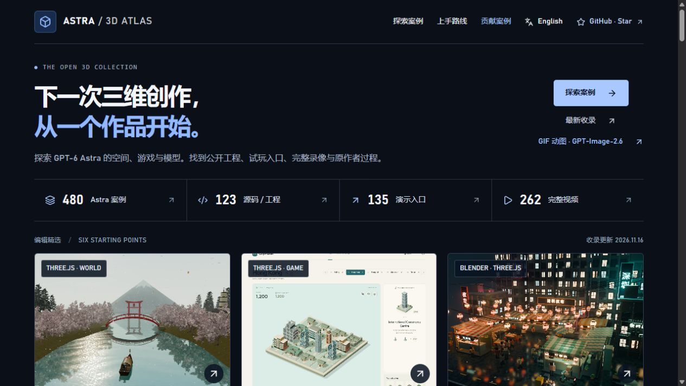
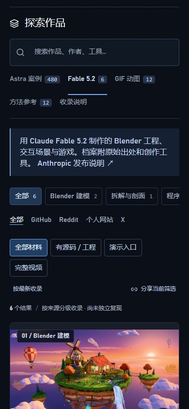
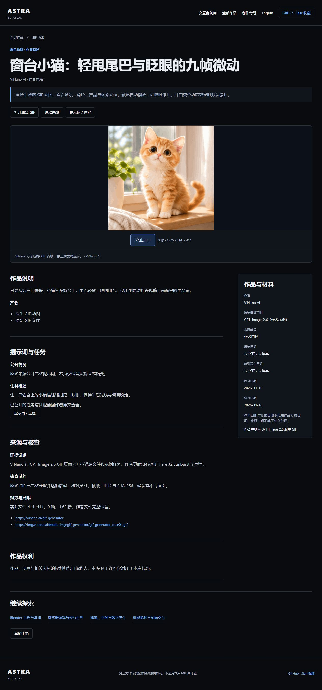

<div align="center">

# Awesome GPT-6 Astra & Claude Fable 5.2 3D

### Your next 3D starting point: public projects, creator demos and complete clips.

Explore Blender models, Three.js games, architectural worlds and exploded assemblies. See the result, inspect the creator's materials, then start with one small change.

**[Explore the gallery](https://carpentry-liu.github.io/awesome-astra-3d/?lang=en) · [Fable 5.2 collection](https://carpentry-liu.github.io/awesome-astra-3d/?lang=en&group=fable#collection) · [Three starting paths](START_HERE.en.md) · [Latest additions](https://carpentry-liu.github.io/awesome-astra-3d/?lang=en&order=newest#collection) · [Contribute](CONTRIBUTING.md)**

[简体中文](README.md) · English · [English website](https://carpentry-liu.github.io/awesome-astra-3d/?lang=en)

</div>

<!-- atlas:summary:start -->
Updated **2026-11-16 (Asia/Shanghai)** · **480 Astra examples** (123 source / project links, 135 demo links, 262 complete clips) · **6 Fable 5.2 examples** · **12 GIF animations** · **12 method references**.
<!-- atlas:summary:end -->

Source / project totals count public material links; demo totals count creator-hosted entry points. They do not establish independent reproduction of every project. Complete videos retain the full posted clip. Each case records attribution and model evidence.

## Claude Fable 5.2 · 3D works

[Explore all Fable 5.2 works](https://carpentry-liu.github.io/awesome-astra-3d/?lang=en&group=fable#collection) · [Complete videos](https://carpentry-liu.github.io/awesome-astra-3d/?lang=en&group=fable&resource=video#collection) · [Anthropic release notes](https://www.anthropic.com/claude-fable-and-mythos-5-2)

| Floating Island · RealCodeBear | Da Vinci’s Living Codex · coding-nanami |
| --- | --- |
| [](https://carpentry-liu.github.io/awesome-astra-3d/en/cases/realcodebear-blender-island-fable/) | [](https://carpentry-liu.github.io/awesome-astra-3d/en/cases/nanami-davinci-mechanics-fable/) |
| [Compare both passes](https://realcodebear.github.io/blender-fable-5.2/#island) · [Download .blend](https://realcodebear.github.io/blender-fable-5.2/blend/S2_FloatingIsland_v2.blend) | [Operate the models](https://davinci-mechanics.vercel.app/) · [Browse the source](https://github.com/coding-nanami/davinci-mechanics) |

| Shelby GT500 · Max | Photo-to-AR Walkthrough · Trace |
| --- | --- |
| [](https://carpentry-liu.github.io/awesome-astra-3d/en/cases/max-shelby-fable/) | [](https://carpentry-liu.github.io/awesome-astra-3d/en/cases/trace-lunch-spot-fable/) |
| [Play the full video](https://carpentry-liu.github.io/awesome-astra-3d/en/cases/max-shelby-fable/#videos) · [Read the prompt](https://x.com/maxt3chno/status/2121603721742127142) | [Play the full video](https://carpentry-liu.github.io/awesome-astra-3d/en/cases/trace-lunch-spot-fable/#videos) · [Original post](https://x.com/Trace_AR/status/2121284000232714559) |

## Native GIF animations · GPT-Image-2.6

[GIF collection](https://carpentry-liu.github.io/awesome-astra-3d/?lang=en&group=gif&order=newest#collection) · [Official generation guide](https://developers.openai.com/api/docs/guides/image-generation#generate-animated-gif-output)

The collection now has twelve original GIFs. The windowsill kitten and letter reveal banner are new. Each preview opens the case and original file.

| Windowsill Kitten · ViNano | Letter Reveal Banner · Predis.ai |
| --- | --- |
| [](https://carpentry-liu.github.io/awesome-astra-3d/en/cases/vinano-window-kitten-gif/) | [](https://carpentry-liu.github.io/awesome-astra-3d/en/cases/predis-sale-lettering-gif/) |

| Lantern Cat · Lightlyn | Raw Pixel Explosion · Kasper Zack Games |
| --- | --- |
| [](https://carpentry-liu.github.io/awesome-astra-3d/en/cases/lightlyn-lantern-cat-gif/) | [](https://carpentry-liu.github.io/awesome-astra-3d/en/cases/kasper-pixel-explosion-gif/) |

GIF previews and case pages play automatically, with Stop / Play controls. Reduced-motion preferences start on the still frame. Works remain the creators’ property.

## Six featured works to start from

| [WITHIN · fatasia](https://fatasia.github.io/within/) | [CityMaker · derek-wangpch](https://citymaker.0to1app.com/) | [Shenzhen After Rain · Skyline](https://kostikoneuro.github.io/kimi-vs-astra/2a-diorama/astra/) |
| --- | --- | --- |
| [](https://fatasia.github.io/within/) | [](https://citymaker.0to1app.com/) | [](https://kostikoneuro.github.io/kimi-vs-astra/2a-diorama/astra/) |
| Explore eighteen worlds, from Sakura to painted cities.<br>[Try the demo](https://fatasia.github.io/within/) · [Case](https://carpentry-liu.github.io/awesome-astra-3d/en/cases/fatasia-within-gallery/) · [Source](https://github.com/fatasia/within) | Merge landmarks into a 3D game of 2048.<br>[Try the demo](https://citymaker.0to1app.com/) · [Case](https://carpentry-liu.github.io/awesome-astra-3d/en/cases/derek-opencitymaker/) · [Source](https://github.com/derek-wangpch/OpenCityMaker) | The image is a Blender render; the demo is a Three.js scene of the same market.<br>[Try the demo](https://kostikoneuro.github.io/kimi-vs-astra/2a-diorama/astra/) · [Case](https://carpentry-liu.github.io/awesome-astra-3d/en/cases/kosti-shenzhen-night-market/) · [Source](https://github.com/KostiKoNeuro/kimi-vs-astra) |
| [Embryo Explorer · Pratik Gandhi](https://embryoexplorer.com/) | [Jetis · bambssquad / Bam](https://bambssquad.github.io/jetis-digital-twin-astra/) | [Five 3D stories · az9713](https://az9713.github.io/gpt-6-astra-builds/latest/) |
| [](https://embryoexplorer.com/) | [](https://bambssquad.github.io/jetis-digital-twin-astra/) | [](https://az9713.github.io/gpt-6-astra-builds/latest/) |
| Zoom into and explore a simplified educational model.<br>[Try the demo](https://embryoexplorer.com/) · [Case](https://carpentry-liu.github.io/awesome-astra-3d/en/cases/pratikgx-embryo-explorer/) · [Source](https://github.com/pratikgx/embryo-explorer) | A DWG-based factory walkthrough and SketchUp export, with dimension assumptions.<br>[Try the demo](https://bambssquad.github.io/jetis-digital-twin-astra/) · [Case](https://carpentry-liu.github.io/awesome-astra-3d/en/cases/bambssquad-jetis-digital-twin/) · [Source](https://github.com/bambssquad/jetis-digital-twin-astra) | Five twenty-second procedural scenes and development notes.<br>[Try the demo](https://az9713.github.io/gpt-6-astra-builds/latest/) · [Case](https://carpentry-liu.github.io/awesome-astra-3d/en/cases/az9713-refined-animations/) · [Source](https://github.com/az9713/gpt-6-astra-builds) |

Select a title or image to open the creator's demo directly. Case pages retain sources, materials and known limitations. Demos are creator-hosted and some require WebGL; preview images remain on creator hosts.

## Choose materials and make one small change

| Your goal | Start here |
| --- | --- |
| Open a `.blend`, change a material or camera | [Blender path](START_HERE.en.md#blender) · [Blender topic](https://carpentry-liu.github.io/awesome-astra-3d/en/topics/blender/) |
| Connect a GLB to a page and adjust an interaction | [Web path](START_HERE.en.md#web) · [Source / project collection](https://carpentry-liu.github.io/awesome-astra-3d/?lang=en&resource=source#collection) |
| Read a game task, then trace it through the code | [Game path](START_HERE.en.md#game) · [Browser games](https://carpentry-liu.github.io/awesome-astra-3d/en/topics/browser-games/) |
| Study spaces, assemblies and motion | [Architecture](https://carpentry-liu.github.io/awesome-astra-3d/en/topics/architecture/) · [Exploded assemblies](https://carpentry-liu.github.io/awesome-astra-3d/en/topics/exploded/) · [Complete clips](https://carpentry-liu.github.io/awesome-astra-3d/?lang=en&resource=video#collection) |
| Try, search or cite | [Creator demos](https://carpentry-liu.github.io/awesome-astra-3d/?lang=en&resource=demo#collection) · [Catalog](CATALOG.md) · [Public JSON](https://carpentry-liu.github.io/awesome-astra-3d/cases.json) |

[Star to save this evolving index of 3D projects and examples](https://github.com/carpentry-liu/awesome-astra-3d). Found your own work or a missing resource? [Submit a case or correction](https://github.com/carpentry-liu/awesome-astra-3d/issues/new?template=case.yml).

## Website preview

[](https://carpentry-liu.github.io/awesome-astra-3d/?lang=en)

The screenshots are from the **November 16, 2026** local production build. Browse in Chinese or English, open topics and share individual case pages.

<details>
<summary>Gallery, mobile and case screenshots · November 16, 2026</summary>

[](https://carpentry-liu.github.io/awesome-astra-3d/?lang=en&group=fable#collection)



[](https://carpentry-liu.github.io/awesome-astra-3d/en/cases/nanami-davinci-mechanics-fable/)

</details>

## Latest additions

Ordered by collection date, separate from each work's original publication and verification dates. Featured works stay independent of daily additions.

The November 16 update adds **seven Astra works, six complete recordings and two original GIFs**. The X clips cover a racing drone, a vintage tram, a miniature Colosseum, a V8 engine, a clockwork swan and a plush dragon. The mechanical typewriter includes an interactive model and its GLB.

<!-- atlas:update-previews:start -->
**New Astra works**

| Racing Drone · Havis | Vintage Tram · Lummox |
| --- | --- |
| [](https://carpentry-liu.github.io/awesome-astra-3d/en/cases/havis-racing-drone/) | [](https://carpentry-liu.github.io/awesome-astra-3d/en/cases/lummox-vintage-tram/) |

| Miniature Colosseum · Rubens Soto | V8 Engine · Havis |
| --- | --- |
| [](https://carpentry-liu.github.io/awesome-astra-3d/en/cases/rubens-mini-colosseum/) | [](https://carpentry-liu.github.io/awesome-astra-3d/en/cases/havis-v8-engine/) |

| Clockwork Swan · teddyaisi | Plush Dragon · AndrIy |
| --- | --- |
| [](https://carpentry-liu.github.io/awesome-astra-3d/en/cases/teddy-clockwork-swan/) | [](https://carpentry-liu.github.io/awesome-astra-3d/en/cases/andriy-plush-dragon/) |

**Interactive 3D · Mechanical Typewriter**

[](https://carpentry-liu.github.io/awesome-astra-3d/en/cases/frontier3d-typewriter/)

Open the Astra column to rotate the author’s model, or download its GLB.
[Open the gallery](https://lab.einsia.ai/frontier3dbench/#case-typewriter) · [GLB](https://lab.einsia.ai/frontier3d/models/typewriter-astra.glb?v=02190fc2c95c)

[Full recordings](https://carpentry-liu.github.io/awesome-astra-3d/?lang=en&resource=video&order=newest#collection) · [Download originals](https://github.com/carpentry-liu/awesome-astra-3d/releases/tag/media-2026-11-16)
<!-- atlas:update-previews:end -->

<!-- atlas:latest:start -->
| Example | Creator | Resources |
| --- | --- | --- |
| [A Floating Island at Sunset: Two Blender Passes](https://carpentry-liu.github.io/awesome-astra-3d/en/cases/realcodebear-blender-island-fable/) | RealCodeBear | [Demo](https://realcodebear.github.io/blender-fable-5.2/#island) · [Source](https://github.com/realcodebear/blender-fable-5.2) · [Original](https://github.com/realcodebear/blender-fable-5.2) |
| [Da Vinci’s Living Codex: Sketch to Exploded View](https://carpentry-liu.github.io/awesome-astra-3d/en/cases/nanami-davinci-mechanics-fable/) | coding-nanami / u/Sufficient_Nobody477 | [Demo](https://davinci-mechanics.vercel.app/) · [Source](https://github.com/coding-nanami/davinci-mechanics) · [Original](https://www.reddit.com/r/TopologyAI/comments/1xvghw6/used_fable_52_to_build_an_interactive_3d_da_vinci/) |
| [Yonkers Rises: A City Boundary Becomes a Walking Mech](https://carpentry-liu.github.io/awesome-astra-3d/en/cases/simonw-yonkers-fable/) | Simon Willison | [Demo](https://tools.simonwillison.net/yonkers-rises) · [Source](https://github.com/simonw/tools/blob/ffe3233016ea2f4805e35adcfb8745ea26c755dd/yonkers-rises.html) · [Original](https://simonwillison.net/2026/Nov/10/yonkers-rises/) |
| [Shelby GT500: Modeling a Car from Reference Views](https://carpentry-liu.github.io/awesome-astra-3d/en/cases/max-shelby-fable/) | Max / @maxt3chno | [Original](https://x.com/maxt3chno/status/2121603388009775599) |
| [A Favorite Lunch Spot Rebuilt for an AR Walkthrough](https://carpentry-liu.github.io/awesome-astra-3d/en/cases/trace-lunch-spot-fable/) | Trace / @Trace_AR | [Original](https://x.com/Trace_AR/status/2121284000232714559) |
| [A Dark Fantasy Browser Game: Blockout, Lighting and Levels](https://carpentry-liu.github.io/awesome-astra-3d/en/cases/mengto-dark-fantasy-fable/) | Meng To / @MengTo | [Original](https://x.com/MengTo/status/2121896633848017145) |
| [Racing Drone: A 3D Frame and Camera Assembly](https://carpentry-liu.github.io/awesome-astra-3d/en/cases/havis-racing-drone/) | Havis \| Claude Code / @HavisT83099 | [Original](https://x.com/HavisT83099/status/2122110265499988342) |
| [Vintage Tram at the Corner: Four 3D Approaches](https://carpentry-liu.github.io/awesome-astra-3d/en/cases/lummox-vintage-tram/) | Lummox / @Lummox_eth | [Original](https://x.com/Lummox_eth/status/2121920575517962425) |
<!-- atlas:latest:end -->

[Full update history →](UPDATES.md) · [Maintenance and verification](docs/maintenance.md)

## Evidence, not assumptions

| Label | Meaning |
| --- | --- |
| Official showcase | An official project page or guide explicitly identifies the model |
| Author statement | An accessible creator post, article or repository identifies the model |
| Secondary evidence | The original page is restricted; a mirror, quote or collection provides the statement |
| Method reference | Separately grouped composition and prompting references, excluded from Astra counts |

Renders, geometry, editable projects and interactive pages are distinguished. Failed attempts and comparisons retain their limitations. Unknown dates and unpublished prompts remain missing. GPT Image 2 references are never relabeled as Astra geometry.

**Inclusion, attribution and an HTTP response do not establish independent reproduction.** External demos can require desktop hardware, WebGPU, additional assets or sign-in. See the [demo audit](data/demo-audit.json), [catalog link audit](data/link-audit.json) and [research notes](data/research.json).

## Run locally

Use Node.js 22.22.0+; the version pinned in `.node-version` is recommended. No API key is needed for this static collection.

```sh
git clone https://github.com/carpentry-liu/awesome-astra-3d.git
cd awesome-astra-3d
npm ci
npm run dev     # Generate case JSON, then start the homepage and detail dialogs
```

```sh
npm run check
npm run lint
npm run build
npm start       # Preview dist/client after building, on port 4173 by default
```

The build generates independent `/cases/`, topic and browse pages; check them through `npm start` after building. It synchronizes catalogs, bilingual statistics, latest additions, public JSON and the sitemap, then exports to `dist/client/`. On Windows with Node 24+, it uses the official npm-distributed Node 22.22.0 runtime for prerender compatibility. Use `npm run catalog` after editing `data/cases.json`.

**Public demo: [GitHub Pages](https://carpentry-liu.github.io/awesome-astra-3d/).** Pull requests run validation, tests, a build and a generated-file check. After a merge to `main`, the [Pages workflow](.github/workflows/pages.yml) also verifies the complete videos and publishes. See the [maintenance guide](docs/maintenance.md).

## Repository map

- [data/cases.json](data/cases.json) and [data/topics.json](data/topics.json): edit case facts and curated topic lists here. Video manifests and source audits also live in `data/`.
- `app/`: welcome page, gallery, details and responsive styling.
- `src/`: filtering, video playback and the read-only WebMCP search tool.
- [scripts/static-pages/](scripts/static-pages/): bilingual templates, labels and routes.
- `scripts/` and [tests/](tests/): data generation, export and video checks, and regression tests.
- [docs/](docs/README.md): current maintenance, requirements, screenshots and review records.

## Contribute and attribution

[Submit a case or correction](https://github.com/carpentry-liu/awesome-astra-3d/issues/new?template=case.yml) with the original creator, explicit model statement and verifiable links. See [CONTRIBUTING.md](CONTRIBUTING.md).

Organization was inspired by [awesome-gpt-image-2](https://github.com/freestylefly/awesome-gpt-image-2) and [GPT-Image2-Skill](https://github.com/wuyoscar/GPT-Image2-Skill). [Tripo's Astra collection](https://github.com/TripoGrowthLab/awesome-astra-prompts) supplied some discovery leads; model attribution is checked against original sources where possible.

Original repository code is [MIT licensed](LICENSE). Third-party works, images, prompts, videos and assets retain their own rights. This license grants no additional redistribution rights. Images remain on creator hosts.

Previously archived X videos use complete source-provided renditions without clipping or transcoding. Full duration means the entire posted clip, not the whole development process. The [media manifest](data/videos.json) records duration, byte count and SHA-256; files live in [GitHub Releases](https://github.com/carpentry-liu/awesome-astra-3d/releases). Their inclusion does not assert additional creator permission. See [rights and removal information](README.md#权利).

Independent collection, not an official OpenAI project.
