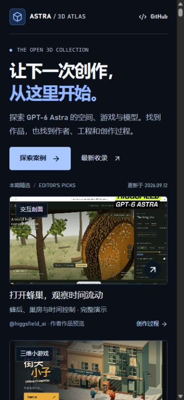

<div align="center">

# Awesome GPT-6 Astra 3D

### 从作品出发，找到下一次三维创作的起点。

探索 GPT-6 Astra 的 3D 作品：Blender、Houdini、Three.js、WebGL、CAD、VRM 与交互游戏。按来源分级，直达工程、演示和完整视频。

**[打开在线演示](https://carpentry-liu.github.io/awesome-astra-3d/) · [探索最新案例](https://carpentry-liu.github.io/awesome-astra-3d/?order=newest#collection) · [贡献案例](CONTRIBUTING.md)**

简体中文 · [English](README.en.md)

</div>

<!-- atlas:summary:start -->
截至 **2026-09-12（Asia/Shanghai）**：**164 条 Astra 案例** · **51 条源码 / 工程** · **62 个演示入口** · **80 个完整视频**。另有 **12 条独立方法参考**，不计入 Astra 数量。
<!-- atlas:summary:end -->

## 这次更新，先看效果

| 蜂巢剖面 · 交互观察 | 街头小子 · 浏览器游戏 | Houdini · 参数化飞机 |
| --- | --- | --- |
| [](https://carpentry-liu.github.io/awesome-astra-3d/#case=higgsfield-beehive) | [](https://carpentry-liu.github.io/awesome-astra-3d/#case=sonic-urban-champion) | [](https://carpentry-liu.github.io/awesome-astra-3d/#case=sokun-houdini-airplane) |
| Blender · 紫顶村庄 | Rhino · 建筑参考重建 | Godot · 石墓阵 |
| [](https://carpentry-liu.github.io/awesome-astra-3d/#case=bootoshi-roblox-village) | [](https://carpentry-liu.github.io/awesome-astra-3d/#case=airilab-rhino-building) | [](https://carpentry-liu.github.io/awesome-astra-3d/#case=tucao-stone-tomb) |

点击图片查看作者、创作过程与完整内容。所有作品图均链接原作者媒体；Rhino 封面左侧是输入参考、右侧是模型预览，村庄的后续变体使用 Nano Banana；石墓阵部分素材来自既有游戏。蜂巢是作者展示的概念模拟，飞机工具尚未公开脚本。

## 网站实拍

[](https://carpentry-liu.github.io/awesome-astra-3d/)

本次更新实拍 · 2026-09-12。点击图片进入案例库。

## 找到你的下一次创作

| 你想做什么 | 从这里开始 |
| --- | --- |
| 先体验作品 | [打开作者演示](https://carpentry-liu.github.io/awesome-astra-3d/?resource=demo#collection)：游戏、建筑漫游、物理实验与交互模型 |
| 下载项目继续修改 | [源码与工程](https://carpentry-liu.github.io/awesome-astra-3d/?resource=source#collection)：Blender、GLB、前端项目和制作脚本 |
| 看完整动态效果 | [完整视频](https://carpentry-liu.github.io/awesome-astra-3d/?resource=video#collection)：原帖片段全部时长及最高画质下载 |
| 跟着已有项目入门 | [上手路线](START_HERE.md)：模型、网页和游戏三条路径 |
| 检索、引用或补充索引 | [全部案例](CATALOG.md) · [公开 JSON](https://carpentry-liu.github.io/awesome-astra-3d/cases.json) · [贡献指南](CONTRIBUTING.md) |

## 最新收录

本轮新增 **14 个案例、5 段完整 X 视频**，涵盖蜂巢交互、街头游戏、Houdini 飞机、Rhino 建筑、Godot 和机器人三视角重建。新增 **2 个源码 / 工程、3 个演示入口**。原帖完整录像、作者来源和混合工具分工一起保留；苏州博物馆和机器人项目还注明了公开文件与本地材料的区别。

<!-- atlas:latest:start -->
| 作品 | 原作者 | 直接入口 |
| --- | --- | --- |
| [蜂巢观察室：蜂后、巢房与时间控制](https://carpentry-liu.github.io/awesome-astra-3d/#case=higgsfield-beehive) | Higgsfield AI 🧩 / @higgsfield_ai | [原始来源](https://x.com/higgsfield_ai/status/2097813773830791259) |
| [街头小子：夕阳街区的三维拳击](https://carpentry-liu.github.io/awesome-astra-3d/#case=sonic-urban-champion) | Sonic的奇思妙想 / @sonic0828 | [演示](https://iamsonic.net/2026/mini-games/urban-champion.html) · [原始来源](https://x.com/sonic0828/status/2097601232877781344) |
| [Houdini 飞机：把模型做成可调工具](https://carpentry-liu.github.io/awesome-astra-3d/#case=sokun-houdini-airplane) | sokun | [原始来源](https://community.openai.com/t/astra-in-action-share-your-builds-breakthroughs-aha-moments/1394945/45) |
| [卡通角色：可摆姿势的 Blender 控制器](https://carpentry-liu.github.io/awesome-astra-3d/#case=higgsfield-cartoon-rig) | Higgsfield AI 🧩 / @higgsfield_ai | [原始来源](https://x.com/higgsfield_ai/status/2097797358847430956) |
| [紫顶村庄：Blender 到 Roblox 的关卡尝试](https://carpentry-liu.github.io/awesome-astra-3d/#case=bootoshi-roblox-village) | BOOTOSHI 👑 / @KingBootoshi | [原始来源](https://x.com/KingBootoshi/status/2097545729573368319) |
| [零点街区：三维生存战斗](https://carpentry-liu.github.io/awesome-astra-3d/#case=sonic-shells-3d) | Sonic的奇思妙想 / @sonic0828 | [演示](https://iamsonic.net/2026/mini-games/shells-3d/play.html) · [原始来源](https://x.com/sonic0828/status/2097601232877781344) |
| [走出画框：Dalí 绘画的 Blender 空间](https://carpentry-liu.github.io/awesome-astra-3d/#case=higgsfield-dali-world) | Higgsfield AI 🧩 / @higgsfield_ai | [原始来源](https://x.com/higgsfield_ai/status/2097830176294146264) |
| [Rhino 建筑：参考图到分层模型](https://carpentry-liu.github.io/awesome-astra-3d/#case=airilab-rhino-building) | AIRIlab | [原始来源](https://www.bilibili.com/video/BV1owbN67E4M/) |
<!-- atlas:latest:end -->

[查看完整更新目录 →](UPDATES.md)

## 首页与浏览体验

- 三件精选同时展示；桌面左侧分类与来源，右侧大图列表，直接打开作品档案。
- 资源统计可以点击，快速进入源码、演示或完整视频集合。
- 案例卡片直接提供源码与演示；关键词、分类、平台和资源筛选可以组合使用。
- 分享链接保留筛选条件；每个案例都有独立锚点，可直接打开详情。
- 手机布局、键盘操作与图片失败提示均保留；方法参考与 Astra 案例分别呈现。

<details>
<summary>查看案例区与手机实拍 · 2026-09-12</summary>

[](https://carpentry-liu.github.io/awesome-astra-3d/?order=newest#collection)



</details>

## 从这些作品继续研究

| 作品 | 可以研究的内容 | 材料 |
| --- | --- | --- |
| [Solace](https://carpentry-liu.github.io/awesome-astra-3d/#case=openai-solace-garden-house) | 建筑概念、Blender 场景、Cycles 镜头与 UE5 漫游 | [作者过程](https://developers.openai.com/blog/architectural-visualization-with-astra) |
| [鹈鹕骑自行车](https://carpentry-liu.github.io/awesome-astra-3d/#case=simonw-pelican-bicycle) | 三轮对话如何改变网格、材质与构图 | [工程与脚本](https://github.com/simonw/gpt-6-astra-blender-pelican-bicycle) |
| [Orbital Core](https://carpentry-liu.github.io/awesome-astra-3d/#case=ruofeng-orbital-core) | Blender → GLB → Three.js 模型交互 | [源码](https://github.com/wangruofeng/orbital-core-showcase) · [演示](https://orbital-core-showcase.wangruofeng007.workers.dev/) |
| [Living Deep](https://carpentry-liu.github.io/awesome-astra-3d/#case=mollick-living-ocean) | 从既有海面程序扩展海底生态 | [源码](https://github.com/emollick/abyssal-living-deep) · [演示](https://abyssal-living-deep.netlify.app/) |
| [Smash Karts](https://carpentry-liu.github.io/awesome-astra-3d/#case=amsminn-smash-karts) | Three.js 多人游戏、服务器与 agent 轨迹 | [源码](https://github.com/amsminn/gpt-6-astra-smash-karts) |

## 每条记录都能追溯

| 标记 | 代表什么 |
| --- | --- |
| 官方展示 | 官方作品页或文章明确标注 Astra |
| 作者自述 | 可读取的作者文章、帖子或仓库明确声明模型 |
| 转引待复核 | 原页读取受限，依据镜像、原文引文或整理页；保留佐证 |
| 方法参考 | 独立的构图或提示词参考，不计入 Astra 案例 |

这里区分渲染图、真实几何、可编辑工程与交互网页，也保留失败样本和对照实验。未知日期与未公开提示词保持缺失；不将参考库的 GPT Image 2 图片当作 Astra 三维产物。**收录、作者声明与链接可达，都不等于本库已独立复现。**

演示由原作者托管，可能依赖桌面浏览器、WebGPU、额外资源或登录。本轮链接核查记录见 [演示检查](data/demo-audit.json) · [全库链接检查](data/link-audit.json)。检索覆盖与未采用线索见 [研究记录](data/research.json)。

## 本地运行与部署

使用 Node.js 22.13+，推荐 22.22.0。静态案例站不需要 API Key。

```sh
git clone https://github.com/carpentry-liu/awesome-astra-3d.git
cd awesome-astra-3d
npm ci
npm run dev
```

```sh
npm run check    # 数据、筛选行为、TypeScript
npm run lint
npm run build    # 同步目录并输出 dist/client
```

Windows Node 24+ 构建会自动使用官方 npm 发行的 Node 22.22.0，以兼容预渲染退出流程。更改 `data/cases.json` 后运行 `npm run catalog`，即可同步中英文统计、最新收录、目录、公开 JSON 与 sitemap。

**公开演示：[GitHub Pages](https://carpentry-liu.github.io/awesome-astra-3d/)**。推送到 `main` 后由 [Pages 工作流](.github/workflows/pages.yml) 执行检查、构建、校验视频并发布。仓库保留现有 Sites 配置用于站点所有者的备用预览；访问范围由原有设置控制。

## 项目结构

| 目录 | 用途 |
| --- | --- |
| `data/` | 案例事实、视频清单、来源研究与链接检查 |
| `app/` | 欢迎页、案例索引、详情与响应式样式 |
| `src/` | 检索契约、视频播放器与只读 WebMCP 工具 |
| `scripts/` · `tests/` | 数据同步、导出校验与行为测试 |
| [docs/](docs/README.md) | 需求、设计、实施和验证记录 |

## 贡献与权利

欢迎提交原作、公开工程、提示词来源或纠错。[提交案例](https://github.com/carpentry-liu/awesome-astra-3d/issues/new?template=case.yml) 时请提供原作者、模型声明和可核查链接。完整要求见 [CONTRIBUTING.md](CONTRIBUTING.md)。

组织方式参考 [awesome-gpt-image-2](https://github.com/freestylefly/awesome-gpt-image-2) 与 [GPT-Image2-Skill](https://github.com/wuyoscar/GPT-Image2-Skill)，使用 [Tripo Astra 索引](https://github.com/TripoGrowthLab/awesome-astra-prompts) 发现部分线索，再回到作者来源核查。

### 权利

本仓库原创代码使用 [MIT](LICENSE)。第三方作品、图片、视频、提示词与资产保留原有权利；MIT 不授予这些材料的重新分发许可。图片外链原站，署名和证据随案例展示。

既有 X 视频以原平台的最高码率和较小播放版本保存在 [GitHub Releases](https://github.com/carpentry-liu/awesome-astra-3d/releases)，未剪辑或转码；完整指原帖片段的全部时长。原视频权利不受本库 MIT 覆盖，也不代表获得作者另行授权。[视频清单](data/videos.json) 记录时长、字节数与 SHA-256。如需更正或移除，请提交 Issue。

独立整理，非 OpenAI 官方项目。
