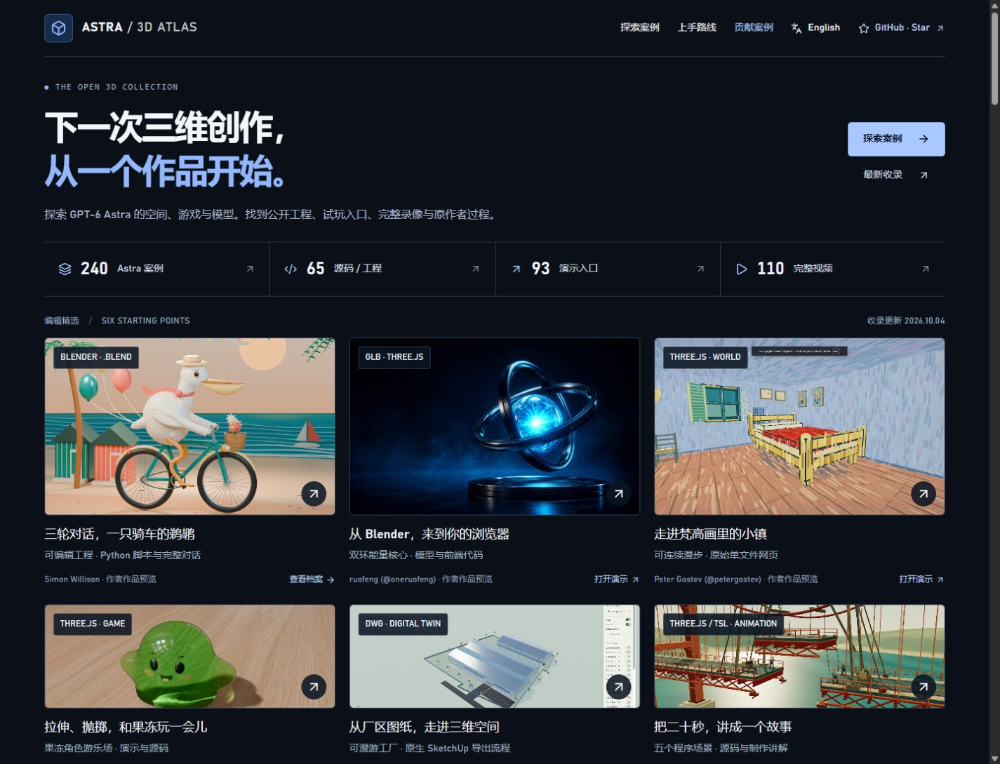
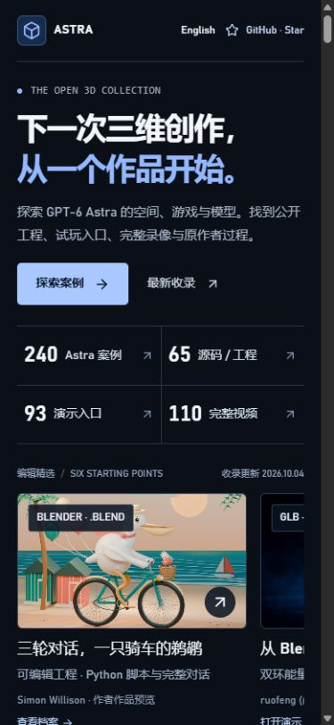
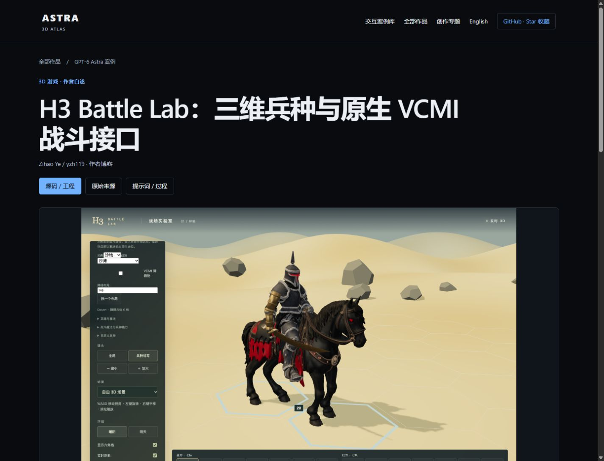

<div align="center">

# Awesome GPT-6 Astra 3D

### 找到下一次三维创作的起点：公开工程、试玩入口与完整录像。

从 Blender 模型到 Three.js 游戏、建筑漫游与机械拆解。先看作品，再找原作者、工程文件和制作过程，选择一个小改动开始。

**[浏览作品库](https://carpentry-liu.github.io/awesome-astra-3d/) · [三条上手路线](START_HERE.md) · [最新收录](https://carpentry-liu.github.io/awesome-astra-3d/?order=newest#collection) · [提交案例](CONTRIBUTING.md)**

简体中文 · [English README](README.en.md) · [English website](https://carpentry-liu.github.io/awesome-astra-3d/?lang=en)

</div>

<!-- atlas:summary:start -->
截至 **2026-10-04（Asia/Shanghai）**：**240 条 Astra 案例** · **65 条源码 / 工程** · **93 个演示入口** · **110 个完整视频**。另有 **12 条独立方法参考**，不计入 Astra 数量。
<!-- atlas:summary:end -->

源码 / 工程数表示作者公开材料的入口，演示数表示作者运行入口；不代表所有工程均已独立复现。完整录像保留原帖片段的全部时长。每条案例注明来源与模型证据。

## 六件精选，先选一个想继续做的作品

| 鹈鹕骑车 · Simon Willison | Orbital Core · ruofeng | 梵高小镇 · Peter Gostev |
| --- | --- | --- |
| [](https://carpentry-liu.github.io/awesome-astra-3d/cases/simonw-pelican-bicycle/) | [](https://carpentry-liu.github.io/awesome-astra-3d/cases/ruofeng-orbital-core/) | [](https://carpentry-liu.github.io/awesome-astra-3d/cases/peter-van-gogh-town/) |
| 三轮 `.blend`、脚本与对话，研究网格和构图怎样迭代。 | Blender → GLB → Three.js，查看模型与交互的连接。 | 连续绘画世界，查看原始 HTML、任务来源与完整录像。 |
| Jelly Baby · Scott | Jetis · bambssquad / Bam | 五个三维故事 · az9713 |
| [](https://carpentry-liu.github.io/awesome-astra-3d/cases/scottstts-jelly-baby/) | [](https://carpentry-liu.github.io/awesome-astra-3d/cases/bambssquad-jetis-digital-twin/) | [](https://carpentry-liu.github.io/awesome-astra-3d/cases/az9713-refined-animations/) |
| 可拉伸、抛掷的 Three.js 角色，带作者演示与源码。 | DWG 到工厂漫游与 SketchUp 导出；尺寸假设另有说明。 | 五个二十秒程序场景，查看 Three.js / TSL 源码与制作讲解。 |

点击图片查看作品档案、材料与已知限制。精选保持稳定，日常新增在下方独立展示；效果图外链原作者媒体。

## 选材料，开始一个小改动

| 你想做什么 | 第一站 |
| --- | --- |
| 打开 `.blend`，改材质或镜头 | [Blender 上手](START_HERE.md#blender) · [Blender 专题](https://carpentry-liu.github.io/awesome-astra-3d/topics/blender/) |
| 把 GLB 接入网页，改一项交互 | [网页上手](START_HERE.md#web) · [源码 / 工程集合](https://carpentry-liu.github.io/awesome-astra-3d/?resource=source#collection) |
| 阅读游戏输入，再找对应代码 | [游戏上手](START_HERE.md#game) · [浏览器游戏专题](https://carpentry-liu.github.io/awesome-astra-3d/topics/browser-games/) |
| 研究空间、部件与动态效果 | [建筑与漫游](https://carpentry-liu.github.io/awesome-astra-3d/topics/architecture/) · [机械拆解](https://carpentry-liu.github.io/awesome-astra-3d/topics/exploded/) · [完整视频](https://carpentry-liu.github.io/awesome-astra-3d/?resource=video#collection) |
| 先体验、检索或引用 | [作者演示](https://carpentry-liu.github.io/awesome-astra-3d/?resource=demo#collection) · [全部目录](CATALOG.md) · [公开 JSON](https://carpentry-liu.github.io/awesome-astra-3d/cases.json) |

[Star 收藏这份持续更新的 3D 工程与案例索引](https://github.com/carpentry-liu/awesome-astra-3d)。发现自己的作品或遗漏材料，可以[提交案例或纠错](https://github.com/carpentry-liu/awesome-astra-3d/issues/new?template=case.yml)。

## 网站实拍

[](https://carpentry-liu.github.io/awesome-astra-3d/)

2026-10-04 本轮生产构建实拍。中文 / 英文浏览、任务专题和作品详情页提供可分享的真实地址；首页首批展示 36 条，继续加载后可浏览其余匹配作品。

<details>
<summary>查看案例区、手机与作品详情实拍 · 2026-10-04</summary>

[](https://carpentry-liu.github.io/awesome-astra-3d/?order=newest#collection)



[](https://carpentry-liu.github.io/awesome-astra-3d/cases/yzh119-h3-battle-lab/)

</details>

## 最新收录

这里按本库收录日期排列；作品首次发布、模型配置与核查日期在各档案中分别记录。稳定精选不随日更替换。

<!-- atlas:latest:start -->
| 作品 | 原作者 | 直接入口 |
| --- | --- | --- |
| [H3 Battle Lab：三维兵种与原生 VCMI 战斗接口](https://carpentry-liu.github.io/awesome-astra-3d/cases/yzh119-h3-battle-lab/) | Zihao Ye / yzh119 | [源码](https://github.com/yzh119/h3-battle-lab) · [原始来源](https://yzh119.github.io/zh/posts/battle-lab/) |
| [FORM / 001：照片参考到程序化三维人物与 GLB](https://carpentry-liu.github.io/awesome-astra-3d/cases/ecooxai-form-001-character/) | ecooxai | [演示](https://ecooxai.github.io/gpt6-astra-pro-colabdev-web-rgirljk/) · [源码](https://github.com/ecooxai/gpt6-astra-pro-colabdev-web-rgirljk) · [原始来源](https://github.com/ecooxai/gpt6-astra-pro-colabdev-web-rgirljk) |
| [Monsoon Funnel：庭院建筑与雨水循环模拟](https://carpentry-liu.github.io/awesome-astra-3d/cases/tianyu-monsoon-funnel/) | Tianyu Xu + Ar. June Chow | [原始来源](https://www.linkedin.com/posts/tianyuxu_a-3d-model-unlimited-exploration-storytelling-activity-7511789216536625152-3nwC) |
| [古画楼阁：从建筑模型到猫角色动作游戏](https://carpentry-liu.github.io/awesome-astra-3d/cases/tianyu-painting-cat-action/) | Tianyu Xu | [原始来源](https://www.linkedin.com/posts/tianyuxu_this-is-a-three-weekend-project-thanks-activity-7509962135574089728-5sIG) |
| [Fluffy Grove：三轮 Blender 林间小屋](https://carpentry-liu.github.io/awesome-astra-3d/cases/wutian-fluffy-grove/) | WuTian / wu_tian吴天 | [原始来源](https://www.bilibili.com/video/BV1Rgty6HEtx/) |
| [WorldGen：三种文字场景到 Blender 与 Unity 世界](https://carpentry-liu.github.io/awesome-astra-3d/cases/andyyuyc-worldgen-unity/) | andyyuyc | [源码](https://github.com/andyyuyc/WorldGen_Unity) · [原始来源](https://github.com/andyyuyc/WorldGen_Unity) |
| [Orbit Lab：太阳、地球与月球的四模型对照](https://carpentry-liu.github.io/awesome-astra-3d/cases/machikita-orbit-lab/) | まちきた / machikita（Tech News Radio） | [演示](https://technewsradio.tokyo/lab/gpt6-vs-opus55/apps/orbit/astra/) · [原始来源](https://zenn.dev/machikita/articles/5fb78e45b55e84) |
| [拉伸试样：从 Blender 脚本到视图与灯光调整](https://carpentry-liu.github.io/awesome-astra-3d/cases/drleeworks-tensile-specimen/) | DrLeeWorks | [原始来源](https://drleeworks.com/en/computing/astra-blender/) |
<!-- atlas:latest:end -->

[完整更新目录 →](UPDATES.md) · [分享素材与衡量说明](docs/sharing/README.md)

## 每条记录都能追溯

| 标记 | 代表什么 |
| --- | --- |
| 官方展示 | 官方作品页或文章明确标注 Astra |
| 作者自述 | 可读取的作者文章、帖子或仓库明确声明模型 |
| 转引待复核 | 原页读取受限，依据镜像、原文引文或整理页；保留佐证 |
| 方法参考 | 独立的构图或提示词参考，不计入 Astra 案例 |

这里区分渲染图、真实几何、可编辑工程与交互网页，也保留失败样本和对照实验。未知日期与未公开提示词保持缺失；不将参考库的 GPT Image 2 图片当作 Astra 三维产物。**收录、作者声明与链接可达，都不等于本库已独立复现。**

演示由原作者托管，可能依赖桌面浏览器、WebGPU、额外资源或登录。本轮链接核查记录见 [演示检查](data/demo-audit.json) · [全库链接检查](data/link-audit.json)。检索覆盖与未采用线索见 [研究记录](data/research.json)。

## 本地运行与部署

使用 Node.js 22.13+，推荐 22.22.0。静态案例站不需要 API Key。

```sh
git clone https://github.com/carpentry-liu/awesome-astra-3d.git
cd awesome-astra-3d
npm ci
npm run dev
```

```sh
npm run check    # 数据、筛选行为、TypeScript
npm run lint
npm run build    # 同步目录并输出 dist/client
```

Windows Node 24+ 构建会自动使用官方 npm 发行的 Node 22.22.0，以兼容预渲染退出流程。更改 `data/cases.json` 后运行 `npm run catalog`，即可同步中英文统计、最新收录、目录、公开 JSON 与 sitemap。

**公开演示：[GitHub Pages](https://carpentry-liu.github.io/awesome-astra-3d/)**。推送到 `main` 后由 [Pages 工作流](.github/workflows/pages.yml) 执行检查、构建、校验视频并发布。仓库保留现有 Sites 配置用于站点所有者的备用预览；访问范围由原有设置控制。

## 项目结构

| 目录 | 用途 |
| --- | --- |
| `data/` | 案例事实、视频清单、来源研究与链接检查 |
| `app/` | 欢迎页、案例索引、详情与响应式样式 |
| `src/` | 检索契约、视频播放器与只读 WebMCP 工具 |
| `scripts/` · `tests/` | 数据同步、导出校验与行为测试 |
| [docs/](docs/README.md) | 需求、设计、实施和验证记录 |

## 贡献与权利

欢迎提交原作、公开工程、提示词来源或纠错。[提交案例](https://github.com/carpentry-liu/awesome-astra-3d/issues/new?template=case.yml) 时请提供原作者、模型声明和可核查链接。完整要求见 [CONTRIBUTING.md](CONTRIBUTING.md)。

组织方式参考 [awesome-gpt-image-2](https://github.com/freestylefly/awesome-gpt-image-2) 与 [GPT-Image2-Skill](https://github.com/wuyoscar/GPT-Image2-Skill)，使用 [Tripo Astra 索引](https://github.com/TripoGrowthLab/awesome-astra-prompts) 发现部分线索，再回到作者来源核查。

### 权利

本仓库原创代码使用 [MIT](LICENSE)。第三方作品、图片、视频、提示词与资产保留原有权利；MIT 不授予这些材料的重新分发许可。图片外链原站，署名和证据随案例展示。

既有 X 视频以原平台的最高码率和较小播放版本保存在 [GitHub Releases](https://github.com/carpentry-liu/awesome-astra-3d/releases)，未剪辑或转码；完整指原帖片段的全部时长。原视频权利不受本库 MIT 覆盖，也不代表获得作者另行授权。[视频清单](data/videos.json) 记录时长、字节数与 SHA-256。如需更正或移除，请提交 Issue。

独立整理，非 OpenAI 官方项目。
