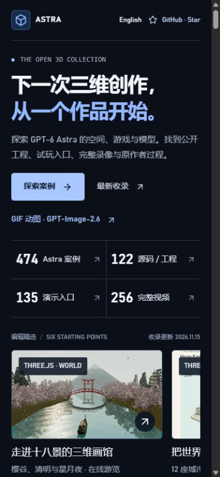

<div align="center">

# Awesome GPT-6 Astra 3D

### 找到下一次三维创作的起点：公开工程、试玩入口与完整录像。

从 Blender 模型到 Three.js 游戏、建筑漫游与机械拆解。先看作品，再找原作者、工程文件和制作过程，选择一个小改动开始。

**[浏览作品库](https://carpentry-liu.github.io/awesome-astra-3d/) · [三条上手路线](START_HERE.md) · [最新收录](https://carpentry-liu.github.io/awesome-astra-3d/?order=newest#collection) · [提交案例](CONTRIBUTING.md)**

简体中文 · [English README](README.en.md) · [English website](https://carpentry-liu.github.io/awesome-astra-3d/?lang=en)

</div>

<!-- atlas:summary:start -->
截至 **2026-11-15（Asia/Shanghai）**：**474 条 Astra 案例** · **122 条源码 / 工程** · **135 个演示入口** · **256 个完整视频**。另有 **10 件 GIF 动图** 与 **12 条独立方法参考**，不计入 Astra 数量。
<!-- atlas:summary:end -->

源码 / 工程数表示作者公开材料的入口，演示数表示作者运行入口；不代表所有工程均已独立复现。完整录像保留原帖片段的全部时长。每条案例注明来源与模型证据。

## GIF 动图 · GPT-Image-2.6

[GIF 动图分类](https://carpentry-liu.github.io/awesome-astra-3d/?group=gif&order=newest#collection) · [官方生成说明](https://developers.openai.com/api/docs/guides/image-generation#generate-animated-gif-output)

现有十件原生 GIF。本次加入 Lightlyn 的提灯橘猫和 Kasper Zack Games 的像素爆炸原始素材。点击下方动图可查看原始文件与制作说明。

| 提灯橘猫 · Lightlyn | 像素爆炸原始素材 · Kasper Zack Games |
| --- | --- |
| [](https://carpentry-liu.github.io/awesome-astra-3d/cases/lightlyn-lantern-cat-gif/) | [](https://carpentry-liu.github.io/awesome-astra-3d/cases/kasper-pixel-explosion-gif/) |

| 落日海岸公路 · imageat | 月夜纸船 · varg.ai |
| --- | --- |
| [](https://carpentry-liu.github.io/awesome-astra-3d/cases/imageat-coastal-drive-gif/) | [](https://carpentry-liu.github.io/awesome-astra-3d/cases/varg-paper-boat-gif/) |

GIF 分类预览与详情自动播放，支持停止与播放。系统开启减少动态效果时默认显示首帧。作品权利归原作者。

## 六件精选，先选一个想继续做的作品

| [入画 WITHIN · fatasia](https://fatasia.github.io/within/) | [CityMaker · derek-wangpch](https://citymaker.0to1app.com/) | [深圳雨夜市集 · Skyline](https://kostikoneuro.github.io/kimi-vs-astra/2a-diorama/astra/) |
| --- | --- | --- |
| [](https://fatasia.github.io/within/) | [](https://citymaker.0to1app.com/) | [](https://kostikoneuro.github.io/kimi-vs-astra/2a-diorama/astra/) |
| 游览樱谷、清明等十八个三维世界。<br>[在线体验](https://fatasia.github.io/within/) · [作品档案](https://carpentry-liu.github.io/awesome-astra-3d/cases/fatasia-within-gallery/) · [源码](https://github.com/fatasia/within) | 把世界地标拼成三维 2048。<br>[在线体验](https://citymaker.0to1app.com/) · [作品档案](https://carpentry-liu.github.io/awesome-astra-3d/cases/derek-opencitymaker/) · [源码](https://github.com/derek-wangpch/OpenCityMaker) | 图为 Blender 成果，演示为同主题 Three.js 夜市。<br>[在线体验](https://kostikoneuro.github.io/kimi-vs-astra/2a-diorama/astra/) · [作品档案](https://carpentry-liu.github.io/awesome-astra-3d/cases/kosti-shenzhen-night-market/) · [源码](https://github.com/KostiKoNeuro/kimi-vs-astra) |
| [Embryo Explorer · Pratik Gandhi](https://embryoexplorer.com/) | [Jetis · bambssquad / Bam](https://bambssquad.github.io/jetis-digital-twin-astra/) | [五个三维故事 · az9713](https://az9713.github.io/gpt-6-astra-builds/latest/) |
| [](https://embryoexplorer.com/) | [](https://bambssquad.github.io/jetis-digital-twin-astra/) | [](https://az9713.github.io/gpt-6-astra-builds/latest/) |
| 缩放、拆分十六阶段的教育示意。<br>[在线体验](https://embryoexplorer.com/) · [作品档案](https://carpentry-liu.github.io/awesome-astra-3d/cases/pratikgx-embryo-explorer/) · [源码](https://github.com/pratikgx/embryo-explorer) | DWG 到工厂漫游与 SketchUp 导出；尺寸假设另有说明。<br>[在线体验](https://bambssquad.github.io/jetis-digital-twin-astra/) · [作品档案](https://carpentry-liu.github.io/awesome-astra-3d/cases/bambssquad-jetis-digital-twin/) · [源码](https://github.com/bambssquad/jetis-digital-twin-astra) | 五个二十秒程序场景与制作讲解。<br>[在线体验](https://az9713.github.io/gpt-6-astra-builds/latest/) · [作品档案](https://carpentry-liu.github.io/awesome-astra-3d/cases/az9713-refined-animations/) · [源码](https://github.com/az9713/gpt-6-astra-builds) |

点击标题或图片直接打开作者演示；作品档案保留来源、材料与已知限制。演示由作者托管，部分场景需要支持 WebGL 的设备；效果图外链原作者媒体。

## 选材料，开始一个小改动

| 你想做什么 | 第一站 |
| --- | --- |
| 打开 `.blend`，改材质或镜头 | [Blender 上手](START_HERE.md#blender) · [Blender 专题](https://carpentry-liu.github.io/awesome-astra-3d/topics/blender/) |
| 把 GLB 接入网页，改一项交互 | [网页上手](START_HERE.md#web) · [源码 / 工程集合](https://carpentry-liu.github.io/awesome-astra-3d/?resource=source#collection) |
| 阅读游戏输入，再找对应代码 | [游戏上手](START_HERE.md#game) · [浏览器游戏专题](https://carpentry-liu.github.io/awesome-astra-3d/topics/browser-games/) |
| 研究空间、部件与动态效果 | [建筑与漫游](https://carpentry-liu.github.io/awesome-astra-3d/topics/architecture/) · [机械拆解](https://carpentry-liu.github.io/awesome-astra-3d/topics/exploded/) · [完整视频](https://carpentry-liu.github.io/awesome-astra-3d/?resource=video#collection) |
| 先体验、检索或引用 | [作者演示](https://carpentry-liu.github.io/awesome-astra-3d/?resource=demo#collection) · [全部目录](CATALOG.md) · [公开 JSON](https://carpentry-liu.github.io/awesome-astra-3d/cases.json) |

[Star 收藏这份持续更新的 3D 工程与案例索引](https://github.com/carpentry-liu/awesome-astra-3d)。发现自己的作品或遗漏材料，可以[提交案例或纠错](https://github.com/carpentry-liu/awesome-astra-3d/issues/new?template=case.yml)。

## 网站实拍

[](https://carpentry-liu.github.io/awesome-astra-3d/)

网站实拍更新于 **2026-11-15**，取自当前版本的本地生产构建；新增内容见下方成果预览与目录。中文 / 英文浏览、任务专题和作品详情页提供可分享的真实地址；首页首批展示 36 条，继续加载后可浏览其余匹配作品。

<details>
<summary>查看案例区、手机与作品详情实拍 · 2026-11-15</summary>

[](https://carpentry-liu.github.io/awesome-astra-3d/?order=newest#collection)



[](https://carpentry-liu.github.io/awesome-astra-3d/cases/lightlyn-lantern-cat-gif/)

</details>

## 最新收录

这里按本库收录日期排列；作品首次发布、模型配置与核查日期在各档案中分别记录。稳定精选不随日更替换。

11 月 15 日新增 **7 件 Astra 作品、6 段完整录像和 2 件原生 GIF**。X 作者展示了三维装机、晶矿列车、郁金香田风车、深海巨蚌、唱片机和白瓷壶倒茶。另可查看办公室生日惊喜的 45 秒 Blender 预演、交互 GLB 和作者评测框架。

<!-- atlas:update-previews:start -->
**新增 Astra 作品**

| 游戏电脑装机 · Havis | 晶矿列车 · Lummox |
| --- | --- |
| [](https://carpentry-liu.github.io/awesome-astra-3d/cases/havis-gaming-pc/) | [](https://carpentry-liu.github.io/awesome-astra-3d/cases/lummox-crystal-train/) |

| 郁金香田风车 · Havis | 深海巨蚌 · teddyaisi |
| --- | --- |
| [](https://carpentry-liu.github.io/awesome-astra-3d/cases/havis-tulip-windmill/) | [](https://carpentry-liu.github.io/awesome-astra-3d/cases/teddy-giant-clam/) |

| 唱针落下 · teddyaisi | 白瓷壶倒茶 · teddyaisi |
| --- | --- |
| [](https://carpentry-liu.github.io/awesome-astra-3d/cases/teddy-record-tonearm/) | [](https://carpentry-liu.github.io/awesome-astra-3d/cases/teddy-teapot-pour/) |

**Blender 预演 · 办公室生日惊喜**

[](https://carpentry-liu.github.io/awesome-astra-3d/cases/vibeprevis-office-birthday/)

打开[作者画廊](https://vibeprevisbench.github.io/#gallery)，选择 **Birthday surprise through the office → GPT-6 Astra**，可在 45 秒预演与交互三维视图间切换。

[完整录像](https://carpentry-liu.github.io/awesome-astra-3d/?resource=video&order=newest#collection) · [下载原版](https://github.com/carpentry-liu/awesome-astra-3d/releases/tag/media-2026-11-15)
<!-- atlas:update-previews:end -->

<!-- atlas:latest:start -->
| 作品 | 原作者 | 直接入口 |
| --- | --- | --- |
| [游戏电脑装机：主板、显卡与 RGB 灯效的三维对照](https://carpentry-liu.github.io/awesome-astra-3d/cases/havis-gaming-pc/) | Havis \| Claude Code / @HavisT83099 | [原始来源](https://x.com/HavisT83099/status/2121747908588380589) |
| [晶矿列车：矿石车驶出发光洞口](https://carpentry-liu.github.io/awesome-astra-3d/cases/lummox-crystal-train/) | Lummox / @Lummox_eth | [原始来源](https://x.com/Lummox_eth/status/2121686941464760464) |
| [郁金香田的风车：用同一张照片重建夕阳场景](https://carpentry-liu.github.io/awesome-astra-3d/cases/havis-tulip-windmill/) | Havis \| Claude Code / @HavisT83099 | [原始来源](https://x.com/HavisT83099/status/2121596994145640579) |
| [办公室生日惊喜：Blender 预演的 45 秒长镜头](https://carpentry-liu.github.io/awesome-astra-3d/cases/vibeprevis-office-birthday/) | VibePrevisBench 作者团队 | [演示](https://vibeprevisbench.github.io/#gallery) · [源码](https://github.com/vibeprevisbench/vibeprevisbench) · [原始来源](https://vibeprevisbench.github.io/#gallery) |
| [深海巨蚌：贝壳打开，露出一颗珍珠](https://carpentry-liu.github.io/awesome-astra-3d/cases/teddy-giant-clam/) | Teddy / @teddyaisi | [原始来源](https://x.com/teddyaisi/status/2121533596854825094) |
| [唱针落下：Three.js 唱片机特写](https://carpentry-liu.github.io/awesome-astra-3d/cases/teddy-record-tonearm/) | Teddy / @teddyaisi | [原始来源](https://x.com/teddyaisi/status/2121497480730927503) |
| [白瓷壶倒茶：细水流落进杯中](https://carpentry-liu.github.io/awesome-astra-3d/cases/teddy-teapot-pour/) | Teddy / @teddyaisi | [原始来源](https://x.com/teddyaisi/status/2121382349690798262) |
| [提灯橘猫：抬爪、眨眼与暖光循环](https://carpentry-liu.github.io/awesome-astra-3d/cases/lightlyn-lantern-cat-gif/) | Lightlyn Images | [GIF](https://image.lightlyn.com/examples/gpt-image-2-6/gif-mascot.gif) · [原始来源](https://image.lightlyn.com/gpt-image-2-6?lang=en) |
<!-- atlas:latest:end -->

[完整更新目录 →](UPDATES.md) · [维护与核查说明](docs/maintenance.md)

## 每条记录都能追溯

| 标记 | 代表什么 |
| --- | --- |
| 官方展示 | 官方作品页或文档明确标注对应模型 |
| 作者自述 | 可读取的作者文章、帖子或仓库明确声明模型 |
| 转引待复核 | 原页读取受限，依据镜像、原文引文或整理页；保留佐证 |
| 方法参考 | 独立的构图或提示词参考，不计入 Astra 案例 |

这里区分渲染图、真实几何、可编辑工程与交互网页，也保留失败样本和对照实验。未知日期与未公开提示词保持缺失；不将参考库的 GPT Image 2 图片当作 Astra 三维产物。**收录、作者声明与链接可达，都不等于本库已独立复现。**

演示由原作者托管，可能依赖桌面浏览器、WebGPU、额外资源或登录。本轮链接核查记录见 [演示检查](data/demo-audit.json) · [全库链接检查](data/link-audit.json)。检索覆盖与未采用线索见 [研究记录](data/research.json)。

## 本地运行与部署

使用 Node.js 22.22.0+，推荐 `.node-version` 固定的 22.22.0。静态案例站不需要 API Key。

```sh
git clone https://github.com/carpentry-liu/awesome-astra-3d.git
cd awesome-astra-3d
npm ci
npm run dev     # 自动生成案例 JSON，再启动首页与详情弹窗
```

```sh
npm run check    # 数据、筛选行为、TypeScript
npm run lint
npm run build    # 同步目录并输出 dist/client
npm start        # 构建后预览 dist/client，默认端口 4173
```

独立 `/cases/`、专题和目录页面由构建生成，使用 `npm run build` 后的 `npm start` 检查。Windows Node 24+ 构建会自动使用官方 npm 发行的 Node 22.22.0，以兼容预渲染退出流程。更改 `data/cases.json` 后运行 `npm run catalog`，即可同步中英文统计、最新收录、目录、公开 JSON 与 sitemap。

**公开演示：[GitHub Pages](https://carpentry-liu.github.io/awesome-astra-3d/)**。提交 PR 会运行数据、测试、构建和目录同步检查。合入 `main` 后，[Pages 工作流](.github/workflows/pages.yml) 还会校验完整录像并发布。维护流程见 [维护说明](docs/maintenance.md)。

## 项目结构

| 目录 | 用途 |
| --- | --- |
| [data/cases.json](data/cases.json) · [data/topics.json](data/topics.json) | 改作品资料或专题选集从这里开始；视频清单与来源核查也在 `data/` |
| `app/` | 欢迎页、案例索引、详情与响应式样式 |
| `src/` | 检索契约、视频播放器与只读 WebMCP 工具 |
| [scripts/static-pages/](scripts/static-pages/) | 中英文静态页的模板、文案和路由 |
| `scripts/` · [tests/](tests/) | 生成数据、校验导出和录像，以及相应的回归测试 |
| [docs/](docs/README.md) | 当前维护说明、需求、截图与审查记录 |

## 贡献与权利

欢迎提交原作、公开工程、提示词来源或纠错。[提交案例](https://github.com/carpentry-liu/awesome-astra-3d/issues/new?template=case.yml) 时请提供原作者、模型声明和可核查链接。完整要求见 [CONTRIBUTING.md](CONTRIBUTING.md)。

组织方式参考 [awesome-gpt-image-2](https://github.com/freestylefly/awesome-gpt-image-2) 与 [GPT-Image2-Skill](https://github.com/wuyoscar/GPT-Image2-Skill)，使用 [Tripo Astra 索引](https://github.com/TripoGrowthLab/awesome-astra-prompts) 发现部分线索，再回到作者来源核查。

### 权利

本仓库原创代码使用 [MIT](LICENSE)。第三方作品、图片、视频、提示词与资产保留原有权利；MIT 不授予这些材料的重新分发许可。图片外链原站，署名和证据随案例展示。

既有 X 视频以原平台的最高码率和较小播放版本保存在 [GitHub Releases](https://github.com/carpentry-liu/awesome-astra-3d/releases)，未剪辑或转码；完整指原帖片段的全部时长。原视频权利不受本库 MIT 覆盖，也不代表获得作者另行授权。[视频清单](data/videos.json) 记录时长、字节数与 SHA-256。如需更正或移除，请提交 Issue。

独立整理，非 OpenAI 官方项目。
