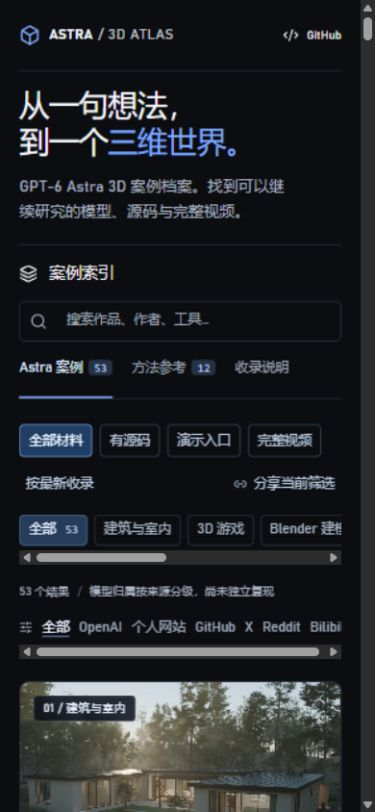

# 验证记录

日期：2026-09-07。关联：R-0002 / F-0002。

## 命令与结果

| 实际命令 | 结果 |
| --- | --- |
| `npm run check` | 通过：65 条数据校验、11 个测试、TypeScript 检查 |
| `npm run lint` | 通过，无错误 |
| `npm run build` | 通过：5 阶段构建、2 条路由预渲染，主页与 9 个资源引用验证成功 |

测试覆盖默认分组隔离、关键词、类别与平台交集、空状态、WebMCP 参数约束、原帖与转引日期区别，以及本轮新增的源码语义、完整视频筛选、最新排序不修改原数据、筛选 URL 往返与 UTM 保留。

Windows 构建沿用现有 Node 22 包装脚本。仍有该脚本的 DEP0190 提示，构建退出码为 0；未新增依赖或修改锁文件。

## 浏览器实测

在本地开发站 `http://localhost:3000/` 使用真实浏览器验证：

- 默认显示 53 个 Astra 案例；“有源码”为 15 个，“完整视频”为 22 个。
- 最新排序后首项为新收录的 Living Deep。
- 点击分享后剪贴板为 `http://localhost:3000/?resource=source&order=newest&utm_source=qa#collection`。刷新后仍为 15 个结果。
- 桌面 1440 × 1000、手机 390 × 844；两种视口均未发生文档水平溢出。手机的类别与平台可在自身区域横向滚动。
- 浏览器错误与警告日志为空。

## 链接与媒体核查

- 新案例的 43 个图片、演示和源码入口 HTTP 检查：42 个成功，1 个演示入口返回 404。已经移除该失效演示，保留原始仓库。200 不等同独立试玩或确认无需登录。
- 24 个新 MP4 下载后检查字节、SHA-256 与探测时长，均通过；GitHub Release 的 24 个上传资产字节数和服务端摘要与本地一致。
- 12 个新播放版本执行全长解码检查：`ffmpeg -v error -i FILE -fps_mode passthrough -enc_time_base demux -f null -`，均退出 0 且无错误输出。
- 初次默认空输出时间基出现过可变帧率 DTS 警告；采用输入时间基重检通过。此命令只输出空接收端，未转码或改写归档文件。原始最高码率版本完成摘要与时长检查，未声称也做了全长解码。

完整下载与 URL 检查日志保存在忽略目录 `work/refresh-2026-09-07/`。GitHub Pages 与 Sites 的线上版本、播放检查结果在发布完成后写入本地交付记录，不在发布前预填成功。

## 发布链路修复

首次 Pages 工作流在下载媒体阶段失败：新媒体清单引用了草稿 Release 返回的 `untagged-` 地址。正式发布会改变下载地址；上传资产完整性检查并不能发现这个问题。已从发布后的 Release API 重新读取 24 个 `browser_download_url`，同步下载入口，增加阻止草稿地址进入数据的校验。随后重新验证构建并发布；保留首次失败记录，未将其记为成功。

修复后对 24 个正式下载链接发起不带凭据的 Range 请求，全部成功并返回 MP4 文件签名；结果保存在 `work/refresh-2026-09-07/published-release-checks.json`。
